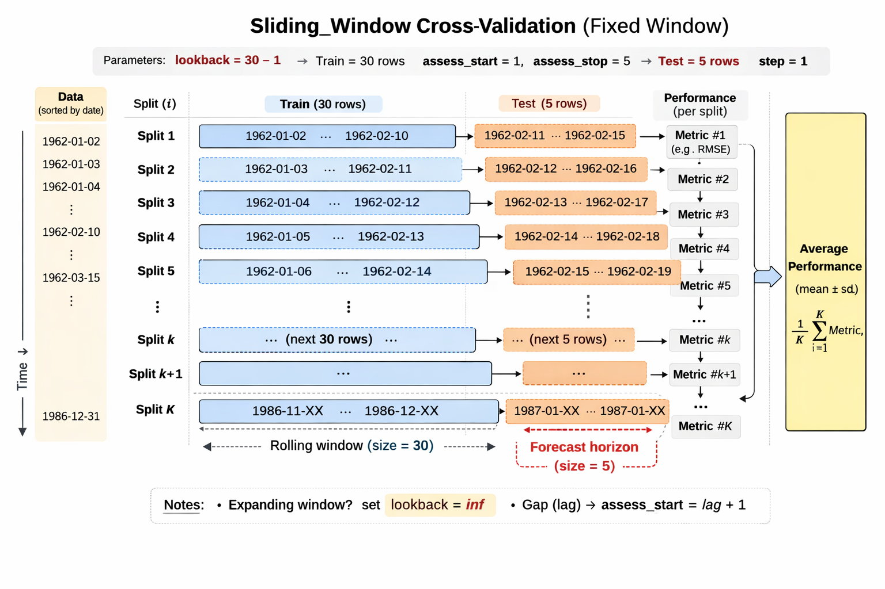
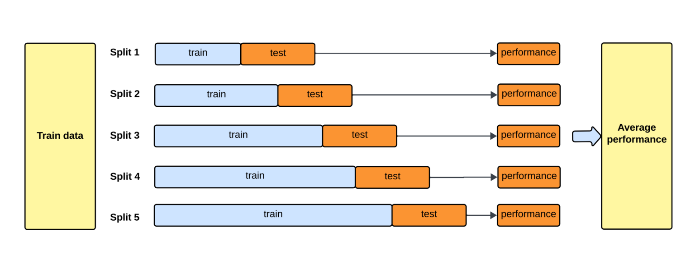

Load R libraries.
```{r}
rm(list = ls())
library(tidyverse)
library(tidymodels)
library(readr)
library(tswge)
library(ggplot2)
library(yardstick)
library(workflows)
library(parsnip)
library(tidyclust)
library(RcppHungarian)

acfdf <- function(vec) {
    vacf <- acf(vec, plot = F)
    with(vacf, data.frame(lag, acf))
}

ggacf <- function(vec) {
    ac <- acfdf(vec)
    ggplot(data = ac, aes(x = lag, y = acf)) + geom_hline(aes(yintercept = 0)) + 
        geom_segment(mapping = aes(xend = lag, yend = 0))
}

tplot <- function(vec) {
    df <- data.frame(X = vec, t = seq_along(vec))
    ggplot(data = df, aes(x = t, y = X)) + geom_line()
}
```

## New York Stock Exchange (NYSE) data (1962-1986) (140 pts)

::: {#fig-nyse}

<p align="center">
{width=600px height=600px}
</p>

Historical trading statistics from the New York Stock Exchange. Daily values of the normalized log trading volume, DJIA return, and log volatility are shown for a 24-year period from 1962-1986. We wish to predict trading volume on any day, given the history on all earlier days. To the left of the red bar (January 2, 1980) is training data, and to the right test data.

:::

The [`NYSE.csv`](https://raw.githubusercontent.com/ucla-biostat-212a/2024winter/master/slides/data/NYSE.csv) file contains three daily time series from the New York Stock Exchange (NYSE) for the period Dec 3, 1962-Dec 31, 1986 (6,051 trading days).

- `Log trading volume` ($v_t$): This is the fraction of all outstanding shares that are traded on that day, relative to a 100-day moving average of past turnover, on the log scale.
    
- `Dow Jones return` ($r_t$): This is the difference between the log of the Dow Jones Industrial Index on consecutive trading days.
    
- `Log volatility` ($z_t$): This is based on the absolute values of daily price movements.

```{r}
# Load NYSE dataset (ISLR2) instead of downloading a CSV
# This avoids broken URLs and guarantees consistent column names.
library(ISLR2)
NYSE <- as_tibble(ISLR2::NYSE) %>%
  mutate(
    date = as.Date(date),
    day_of_week = as.factor(day_of_week),
    train = as.logical(train)
  )

NYSE
```
The **autocorrelation** at lag $\ell$ is the correlation of all pairs $(v_t, v_{t-\ell})$ that are $\ell$ trading days apart. These sizable correlations give us confidence that past values will be helpful in predicting the future.

```{r}
#| code-fold: true
#| label: fig-nyse-autocor
#| fig-cap: "The autocorrelation function for log volume. We see that nearby values are fairly strongly correlated, with correlations above 0.2 as far as 20 days apart."

ggacf(NYSE$log_volume) + ggthemes::theme_few()

```

Do a similar plot for (1) the correlation between $v_t$ and lag $\ell$ `Dow Jones return` $r_{t-\ell}$ and (2) correlation between $v_t$ and lag $\ell$ `Log volatility` $z_{t-\ell}$.

```{r}
#| code-fold: true
#| label: fig-v-vs-lagged-r
#| fig-cap: "Correlations between log_volume and lagged DJ_return."

seq(1, 30) %>% 
  map(function(x) {cor(NYSE$log_volume , lag(NYSE$DJ_return, x), use = "pairwise.complete.obs")}) %>% 
  unlist() %>% 
  tibble(lag = 1:30, cor = .) %>% 
  ggplot(aes(x = lag, y = cor)) + 
  geom_hline(aes(yintercept = 0)) + 
  geom_segment(mapping = aes(xend = lag, yend = 0)) + 
  ggtitle("AutoCorrelation between `log volume` and lagged `DJ return`")
```
```{r}
#| code-fold: true
#| label: fig-v-vs-lagged-z
#| fig-cap: "Weak correlations between log_volume and lagged log_volatility."

seq(1, 30) %>% 
  map(function(x) {cor(NYSE$log_volume , lag(NYSE$log_volatility, x), use = "pairwise.complete.obs")}) %>% 
  unlist() %>% 
  tibble(lag = 1:30, cor = .) %>% 
  ggplot(aes(x = lag, y = cor)) + 
  geom_hline(aes(yintercept = 0)) + 
  geom_segment(mapping = aes(xend = lag, yend = 0)) + 
  ggtitle("AutoCorrelation between `log volume` and lagged `log volatility`")
```


### Project goal

Our goal is to forecast daily `Log trading volume`, using various machine learning algorithms we learnt in this class. 

The data set is already split into train (before Jan 1st, 1980, $n_{\text{train}} = 4,281$) and test (after Jan 1st, 1980, $n_{\text{test}} = 1,770$) sets.

<!-- Include `day_of_week` as a predictor in the models. -->

In general, we will tune the lag $L$ to acheive best forecasting performance. In this project, we would fix $L=5$. That is we always use the previous five trading days' data to forecast today's `log trading volume`.

Pay attention to the nuance of splitting time series data for cross validation. Study and use the [`time-series`](https://www.tidymodels.org/learn/models/time-series/) functionality in tidymodels. Make sure to use the same splits when tuning different machine learning algorithms.

Use the $R^2$ between forecast and actual values as the cross validation and test evaluation criterion.

### Baseline method 

We use the straw man (use yesterday’s value of `log trading volume` to predict that of today) as the baseline method. Evaluate the $R^2$ of this method on the test data.


Before we tune different machine learning methods, let's first separate into the test and non-test sets. We drop the first 5 trading days which lack some lagged variables.

```{r, eval = F}
# Lag: look back L trading days
# Do not need to include, as we included them in receipe
L = 5

for(i in seq(1, L)) {
  NYSE <- NYSE %>% 
    mutate(!!paste("DJ_return_lag", i, sep = "") := lag(NYSE$DJ_return, i),
           !!paste("log_volume_lag", i, sep = "") := lag(NYSE$log_volume, i),
           !!paste("log_volatility_lag", i, sep = "") := lag(NYSE$log_volatility, i))
}


NYSE <-   NYSE %>% na.omit()
```


```{r}
# Drop beginning trading days which lack some lagged variables
NYSE_other <- NYSE %>% 
  filter(train == 'TRUE') %>%
  select(-train) %>%
  drop_na()
dim(NYSE_other)
```

```{r}
NYSE_test = NYSE %>% 
  filter(train == 'FALSE') %>%
  select(-train) %>%
  drop_na()
dim(NYSE_test)
```

```{r}
library(yardstick)
# cor(NYSE_test$log_volume, NYSE_test$log_volume_lag1) %>% round(2)
r2_test_strawman =  rsq_vec(NYSE_test$log_volume, lag(NYSE_test$log_volume, 1)) %>% round(2)
print(paste("Straw man test R2: ", r2_test_strawman))
```


### Autoregression (AR) forecaster 

- Let
$$
y = \begin{pmatrix} v_{L+1} \\ v_{L+2} \\ v_{L+3} \\ \vdots \\ v_T \end{pmatrix}, \quad M = \begin{pmatrix}
1 & v_L & v_{L-1} & \cdots & v_1 \\
1 & v_{L+1} & v_{L} & \cdots & v_2 \\
\vdots & \vdots & \vdots & \ddots & \vdots \\
1 & v_{T-1} & v_{T-2} & \cdots & v_{T-L}
\end{pmatrix}.
$$

- Fit an ordinary least squares (OLS) regression of $y$ on $M$, giving
$$
\hat v_t = \hat \beta_0 + \hat \beta_1 v_{t-1} + \hat \beta_2 v_{t-2} + \cdots + \hat \beta_L v_{t-L},
$$
known as an **order-$L$ autoregression** model or **AR($L$)**.

- Before we start the model training, let's talk about time series resampling. We will use the `rolling_origin` function in the `rsample` package to create a time series cross-validation plan.

- When the data have a strong time component, a resampling method should support modeling to estimate seasonal and other temporal trends within the data. A technique that randomly samples values from the training set can disrupt the model’s ability to estimate these patterns.


```{r}
NYSE %>% 
  ggplot(aes(x = date, y = log_volume)) + 
  geom_line() + 
  geom_smooth(method = "lm")
```


```{r}
wrong_split <- initial_split(NYSE_other)

bind_rows(
  training(wrong_split) %>% mutate(type = "train"),
  testing(wrong_split) %>% mutate(type = "test")
) %>% 
  ggplot(aes(x = date, y = log_volume, color = type, group = NA)) + 
  geom_line()
```

```{r}
correct_split <- initial_time_split(NYSE_other %>% arrange(date))

bind_rows(
  training(correct_split) %>% mutate(type = "train"),
  testing(correct_split) %>% mutate(type = "test")
) %>% 
  ggplot(aes(x = date, y = log_volume, color = type, group = NA)) + 
  geom_line()
```

```{r}
# rolling_origin is no longer supported in the latest version of tidymodels. Instead, we can use sliding_period with appropriate parameters to achieve a similar effect.
# rolling_origin(NYSE_other %>% arrange(date), initial = 30, assess = 5, cumulative = F) %>%
# sliding_period(NYSE_other %>% arrange(date), date, period = "day", lookback = Inf, assess_stop = 1) %>% 
NYSE_other %>%
  arrange(date) %>%
  sliding_window(
    lookback      = 30 - 1L,  # analysis size = lookback + 1  -> 30 rows
    assess_start  = 1L,
    assess_stop   = 5L,       # assessment size -> 5 rows
    complete      = TRUE,
    step          = 1L,
    skip          = 0L
  ) %>%
  mutate(train_data = map(splits, analysis),
         test_data = map(splits, assessment)) %>% 
  select(-splits) %>% 
  pivot_longer(-id) %>% 
  filter(id %in% c("Slice0001", "Slice0100", "Slice1000")) %>% 
  unnest(value) %>% 
  ggplot(aes(x = date, y = log_volume, color = name, group = NA)) + 
  geom_point() + 
  geom_line() +
  facet_wrap(~id, scales = "free")
```

<p align="center">

</p>


- Another type of cross validation method
  + `period = "month"`: break the daily dates into monthly groups.
  + `lookback = Inf`: use an expanding window for training (analysis set grows over time).
  + `assess_stop = 1` (and default `assess_start = 1`): the assessment set is the next 1 month after the current month.
  + So the folds look like:
    - **Slice 1**: train = month 1, test = month 2
    - **Slice 2**: train = months 1–2, test = month 3
    - **Slice 3**: train = months 1–3, test = month 4
    - and so on.
```{r}
sliding_period(NYSE_other %>% arrange(date), 
               date, 
               period = "month", 
               lookback = Inf, 
               assess_stop = 1,
# remove first several splits with short train data to get more stable estimates of the model performance
               skip = 11) %>% 
  mutate(train_data = map(splits, analysis),
         test_data = map(splits, assessment)) %>% 
  select(-splits) %>% 
  pivot_longer(-id) %>% 
  filter(id %in% c("Slice001", "Slice050", "Slice100")) %>% 
  unnest(value) %>% 
  ggplot(aes(x = date, y = log_volume, color = name, group = NA)) + 
  geom_point() +
  geom_line() + 
  facet_wrap(~id, scales = "free")
```

<p align="center">
{width=500px}
</p>


- Rolling forecast origin resampling ([Hyndman and Athanasopoulos 2018](https://otexts.com/fpp3/)) provides a method that emulates how time series data is often partitioned in practice, estimating the model with historical data and evaluating it with the most recent data. 


#### Tune AR(5) with elastic net (lasso + ridge) (20pts)

- regularization using all 3 features on the training data, and evaluate the test performance. 

- Hint: [Workflow: Lasso](https://ucla-biostat-274.github.io/2026winter/slides/06-modelselection/workflow_lasso.html) is a good starting point.

#### Random forest forecaster (20pts)

- Use the same features as in AR($L$) for the random forest. Tune the random forest and evaluate the test performance.

- Hint: [Workflow: Random Forest for Prediction](https://ucla-biostat-274.github.io/2026winter/slides/08-tree/workflow_rf_reg.html) is a good starting point.

#### Boosting forecaster (20pts)

- Use the same features as in AR($L$) for the boosting. Tune the boosting algorithm and evaluate the test performance.

- Hint: [Workflow: Boosting tree for Prediction](https://ucla-biostat-274.github.io/2026winter/slides/08-tree/workflow_boosting_reg.html) is a good starting point.


### Deep learning forecasters: Simple RNN, LSTM, Transformer 

In the random forest / boosting parts above, we **flatten** the past $L$ days into a single feature vector.
Here we instead treat the past $L$ days as a **sequence** with shape $(L, p)$, where $p=3$ features:
$$
x_t = \big[(v_{t-L}, r_{t-L}, z_{t-L}), \dots, (v_{t-1}, r_{t-1}, z_{t-1})\big].
$$
We then learn a function $f_\theta(\cdot)$ to predict $v_t$:
$$
\hat v_t = f_\theta(x_t).
$$

**Important for fair comparison:** we keep the same lookback window $L=5$ and the same raw inputs
$(v, r, z)$ as the tree-based methods.

#### Create supervised sequences  

```{r}
# install.packages("keras3") if needed
library(keras3)         
library(tensorflow)
library(reticulate)
use_backend("tensorflow")
set_random_seed(1)
```

```{r, eval=F}
L <- 5L
feat_cols <- c("log_volume", "DJ_return", "log_volatility")
target_col <- "log_volume"

make_sequences <- function(df, L = 5L, feat_cols, target_col, train_col = "train") {
  df <- df %>% arrange(date)

  xmat <- as.matrix(df[, feat_cols])
  yvec <- df[[target_col]]
  train_flag <- df[[train_col]]

  n <- nrow(df)
  n_samp <- n - L
  p <- length(feat_cols)

  X <- array(NA_real_, dim = c(n_samp, L, p))
  for (i in seq_len(n_samp)) {
    X[i,,] <- xmat[i:(i + L - 1), , drop = FALSE]
  }

  list(
    X = X,
    y = yvec[(L + 1):n],
    train = train_flag[(L + 1):n],
    date = df$date[(L + 1):n]
  )
}

seqdat <- make_sequences(NYSE, L = L, feat_cols = feat_cols, target_col = target_col)

X_all <- seqdat$X
y_all <- seqdat$y
is_train <- seqdat$train

X_train <- X_all[is_train, , , drop = FALSE]
y_train <- y_all[is_train]
X_test  <- X_all[!is_train, , , drop = FALSE]
y_test  <- y_all[!is_train]

dim(X_train); dim(X_test)
```

####  Standardize using training data only

```{r, eval=F}
scale_3d <- function(X, mu, sig) {
  Xs <- X
  for (j in seq_along(mu)) {
    Xs[,,j] <- (Xs[,,j] - mu[j]) / sig[j]
  }
  Xs
}

# Feature-wise mean/sd across all training samples and timesteps
mu_x <- apply(X_train, 3, mean)
sd_x <- apply(X_train, 3, sd)

X_train_s <- scale_3d(X_train, mu_x, sd_x)
X_test_s  <- scale_3d(X_test,  mu_x, sd_x)

# (Optional but often helpful) standardize y for NN optimization
mu_y <- mean(y_train)
sd_y <- sd(y_train)

y_train_s <- (y_train - mu_y) / sd_y
y_test_s  <- (y_test  - mu_y) / sd_y

# Create a time-ordered validation split from training
n_tr <- dim(X_train_s)[1]
val_n <- floor(0.2 * n_tr)

X_tr  <- X_train_s[1:(n_tr - val_n), , , drop = FALSE]
y_tr  <- y_train_s[1:(n_tr - val_n)]
X_val <- X_train_s[(n_tr - val_n + 1):n_tr, , , drop = FALSE]
y_val <- y_train_s[(n_tr - val_n + 1):n_tr]

c(n_train = dim(X_tr)[1], n_val = dim(X_val)[1], n_test = dim(X_test_s)[1])
```

#### Helper: fit + evaluate (RMSE, $R^2$)

```{r, eval=F}
library(yardstick)

metrics_reg <- function(truth, pred) {
  tibble(
    rmse = rmse_vec(truth, pred),
    rsq  = rsq_vec(truth, pred)
  )
}

fit_and_eval <- function(model, X_tr, y_tr, X_val, y_val, X_te, y_te,
                         epochs = 50, batch_size = 32, lr = 1e-3, 
                         patience = 5, l2 = 1e-4) {  
  model %>% compile(
    # weight_decay applies L2 penalty to all weights during optimization
    optimizer = optimizer_adam(learning_rate = lr, weight_decay = l2),
    loss = "mse"
  )

  hist <- model %>% fit(
    X_tr, matrix(y_tr, ncol = 1),
    validation_data = list(X_val, matrix(y_val, ncol = 1)),
    epochs     = epochs,
    batch_size = batch_size,
    callbacks  = list(
      callback_early_stopping(
        patience             = patience, 
        restore_best_weights = TRUE,
        monitor              = "val_loss"   
      ),
      callback_reduce_lr_on_plateau(       
        monitor  = "val_loss",
        factor   = 0.5,
        patience = 3,
        min_lr   = 1e-6
      )
    ),
    verbose = 0
  )

  pred_s <- as.numeric(model %>% predict(X_te, verbose = 0))
  pred   <- pred_s * sd_y + mu_y
  out    <- metrics_reg(y_te, pred)
  list(history = hist, pred = pred, metrics = out)
}
```

#### Model A: Simple RNN (20pts)


#### Model B: LSTM (20pts)


####  Model C: 1D CNN (Conv1D) (20pts)

A small **1D convolutional network** is a strong baseline for short lookback windows like $L=5$.
It learns local temporal patterns (e.g., 2–3 day) and then aggregates across time.


#### Model D: Transformer encoder (Optional)

We build a small Transformer-style encoder using Keras' `layer_multi_head_attention()`.

- Input: $(L, p)$
- Project to $d_{\text{model}}$
- Add a **trainable positional embedding**
- Repeat: (Self-attention + residual + LayerNorm) then (FFN + residual + LayerNorm)
- Pool across time and predict $v_t$


```{r, eval=F}
transformer_encoder_block <- function(x, d_model, num_heads, d_ff, dropout = 0.1) {
  # Self-attention + residual + LayerNorm
  attn <- layer_multi_head_attention(
    num_heads = as.integer(num_heads),
    key_dim   = as.integer(d_model / num_heads),
    dropout   = dropout
  )(query = x, value = x, key = x)

  x <- layer_add()(list(x, attn))
  x <- layer_layer_normalization(epsilon = 1e-6)(x)

  # FFN + residual + LayerNorm
  ffn <- x |>
    layer_dense(units = as.integer(d_ff), activation = "relu") |>
    layer_dropout(rate = dropout) |>
    layer_dense(units = as.integer(d_model))

  x <- layer_add()(list(x, ffn))
  x <- layer_layer_normalization(epsilon = 1e-6)(x)
  x
}

build_transformer <- function(L, p, d_model = 32, num_heads = 4,
                               d_ff = 64, dropout = 0.1, n_blocks = 1) {

  L       <- as.integer(L)
  d_model <- as.integer(d_model)

  inputs <- keras_input(shape = c(L, p))

  x <- inputs |> layer_dense(units = d_model)

  pos_emb <- layer_embedding(input_dim = L, output_dim = d_model)
  pos     <- tf$range(L, dtype = "int32")
  pos_out <- pos_emb(pos)
  pos_out <- op_expand_dims(pos_out, axis = 1L)
  x       <- layer_add()(list(x, pos_out))

  for (b in seq_len(n_blocks)) {
    x <- transformer_encoder_block(
           x,
           d_model   = d_model,
           num_heads = num_heads,
           d_ff      = d_ff,
           dropout   = dropout
         )
  }

  outputs <- x |>
    layer_global_average_pooling_1d() |>
    layer_dense(units = 1)

  keras_model(inputs, outputs)
}

tr_model <- build_transformer(
  L         = L,
  p         = length(feat_cols),
  d_model   = 32,
  num_heads = 4,
  d_ff      = 64,
  dropout   = 0.1,
  n_blocks  = 1
)

tr_fit <- fit_and_eval(tr_model, X_tr, y_tr, X_val, y_val, X_test_s, y_test,
                       epochs = 80, lr = 1e-3, patience = 8)
tr_fit$metrics
```

#### Compare test performance (append to your summary table)

```{r, eval = F}
dl_results <- bind_rows(
  tibble(Method = "RNN",         rnn_fit$metrics),
  tibble(Method = "LSTM",        lstm_fit$metrics),
  tibble(Method = "1D CNN",      cnn_fit$metrics),
  tibble(Method = "Transformer", tr_fit$metrics)
)

dl_results
```


### Summary (20pts)

Your score for this question is largely determined by your final test performance. 

Summarize the performance of different machine learning forecasters in the following format. 

- Which model gives the best test RMSE?
- Do the gains (if any) justify the extra complexity vs random forest / boosting?
- Explain the difference between AR(5) and the deep learning models. Why might the deep learning models perform better or worse than AR(5)?
- Explain the model performance difference within deep learning models (RNN vs LSTM vs CNN vs Transformer)? 
- (Optional) If you have time, you can also try tuning the lookback window $L$ for each model and see how it affects performance.


| Method | CV $R^2$ | Test $R^2$ |
|:------:|:------:|:------:|:------:|
| Baseline | | | |
| AR(5) | | | |
| Random Forest | | | |
| Boosting | | | |
| RNN | | | |
| LSTM | | | |
| 1D CNN | | | |
| Transformer | | | |


## Hospital readmission under domain shift, recalibration, and uncertainty (140 pts)

In many real deployments, a risk score trained in one population **does not transfer** to a different population (different payer mix, admission pathway, etc.). In this project you will:

1. Train a readmission risk score in a **source domain**.
2. Apply it “as-is” to a different **target domain** and quantify performance degradation (especially calibration).
3. **Recalibrate** predicted probabilities using a small labeled calibration set from the target domain.
4. Quantify **uncertainty** in performance (and optionally predictive uncertainty).

The dataset is already tabular and relatively clean.

### Data

We will use the `readmission` package, which provides a simplified hospital readmission dataset with outcome `readmitted` and a small set of predictors (demographics + utilization counts + a few categorical fields).

```{r, eval = FALSE}
# install.packages("readmission")  # if needed
library(readmission)

df <- readmission::readmission %>%
  as_tibble() %>%
  mutate(
    # ensure consistent outcome levels
    readmitted = factor(readmitted, levels = c("No", "Yes")),
    across(c(race, sex, age, admission_source, blood_glucose, insurer), as.factor),
    blood_glucose = forcats::fct_explicit_na(blood_glucose, na_level = "Missing")
  )

glimpse(df)
```

### Project goal

Train a risk score $\hat p(x)$ for 30-day readmission and evaluate it under **domain shift**.

You will report:

- **Discrimination:** AUROC (and optionally AUPRC).
- **Calibration:** Brier score + calibration curve + calibration intercept/slope.
- **Recalibration impact:** compare target-domain calibration *before vs after* recalibration.
- **Uncertainty:** bootstrap confidence intervals for AUROC and Brier on the target test set.

---

### Define domains + data splits (20 pts)


- Source domain: `insurer == "Private"` (or `"Medicaid"`)
- Target domain: `insurer == "Medicare"` (or `"Self-pay"`)


Create *four* datasets:

- `source_train`, `source_test` (split within source domain)
- `target_cal`, `target_test` (split within target domain)

Rules:

- You may tune models using only `source_train` (and CV within source).
- You may fit recalibration models using only `target_cal`.
- You must report final target performance on the held-out `target_test` only.

```{r, eval = FALSE}
library(tidymodels)

set.seed(1)


 source_df <- df %>% filter(insurer == "Private")
 target_df <- df %>% filter(insurer == "Medicare")

# Split source into train/test
source_split <- initial_split(source_df, prop = 0.8, strata = readmitted)
source_train <- training(source_split)
source_test  <- testing(source_split)

# Split target into calibration/test (calibration is small but labeled)
target_split <- initial_split(target_df, prop = 0.3, strata = readmitted)
target_cal  <- training(target_split)
target_test <- testing(target_split)

c(n_source_train = nrow(source_train),
  n_source_test  = nrow(source_test),
  n_target_cal   = nrow(target_cal),
  n_target_test  = nrow(target_test))
```

---

###  Baseline model: regularized logistic regression (20 pts)

Train a baseline risk score using regularized logistic regression (e.g., `glmnet`).

- Use a preprocessing recipe (dummy encoding + handle novel levels).
- Tune at least one hyperparameter (e.g., penalty) using CV on `source_train`.


---

### Second model: boosting tree or random forest (20 pts)

Train a second model that can capture nonlinearities/interactions.

Choose **one**:
- Gradient boosting (recommended): `boost_tree()` with engine `"xgboost"`.
- Random forest: `rand_forest()` with engine `"ranger"`.

Tune at least one hyperparameter (e.g., `mtry`, `trees`, `tree_depth`).


---

### Evaluate domain shift (before recalibration) (30 pts)

For **each model**, evaluate:

- On `source_test` (in-domain)
- On `target_test` (out-of-domain, *before* recalibration)

Report:
- AUROC
- Brier score
- Calibration curve (10 bins)
- Calibration intercept + slope

---

### Recalibration on the target domain (30 pts)

Using only `target_cal`, fit recalibration maps for each model.

Required recalibration methods:

1) **Intercept-only recalibration** (calibration-in-the-large):  
   $$\text{logit}(P(Y=1)) = \alpha + 1\cdot \text{logit}(\hat p)$$

2) **Logistic recalibration** (slope + intercept):  
   $$\text{logit}(P(Y=1)) = \alpha + \gamma\\,\text{logit}(\hat p)$$

Then apply the fitted recalibrator to predictions on `target_test` and re-evaluate AUROC, Brier, calibration slope/intercept, and calibration curve.


Evaluate (after recalibration) by plugging `p_test_int` / `p_test_slp` into your metric functions.

Your write-up should clearly show **before vs after** calibration plots and report how the calibration intercept/slope changed.

---

### Uncertainty (10 pts)

Compute uncertainty for target-domain prediction.


---

### Summary (10 pts)

Create a final table comparing **source vs target** performance for each model:

- AUROC and Brier on `source_test`
- AUROC and Brier on `target_test` (before recalibration)
- AUROC and Brier on `target_test` (after recalibration; choose your best recalibrator)

Example format:

| Model | Source AUROC | Target AUROC (raw) | Target AUROC (recal) | Target Brier (raw) | Target Brier (recal) |
|:--|--:|--:|--:|--:|--:|

In 8–12 sentences, interpret:
- what changed under shift (discrimination vs calibration),
- which recalibration helped most,
- and what your uncertainty analysis says about reliability.


