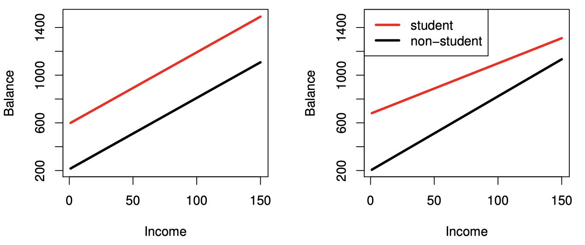
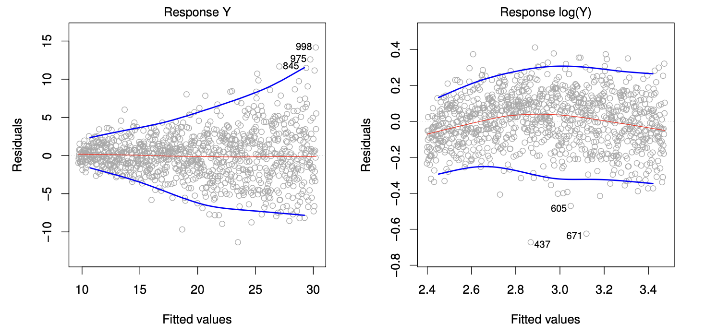

Credit: This note heavily uses material from the books [_An Introduction to Statistical Learning: with Applications in R_](https://www.statlearning.com/) (ISL2) and [_Elements of Statistical Learning: Data Mining, Inference, and Prediction_](https://hastie.su.domains/ElemStatLearn/) (ESL2).

Display system information for reproducibility.

::: {.panel-tabset}

## R

```{r}
sessionInfo()
```

## Python

```{python}
import IPython
print(IPython.sys_info())
```


:::


## Linear regression in this course: a modern ML baseline

Many of you have already learned linear regression as a *statistical* tool (estimation, confidence intervals, $t$-tests, $F$-tests, interpretation).
In this course, we start with linear regression as a **machine learning algorithm**.

- **Task:** supervised learning (regression).
- **Goal:** accurate prediction on *new, unseen* data (**generalization**).
- **Why:** it is fast, surprisingly strong, and a foundation for many modern methods (regularization, kernels, neural networks). Understanding linear methods is essential for understanding nonlinear
ones.

### The supervised learning pipeline

We will repeatedly use the same template throughout the course:

1. **Data:** features $X \in \mathbb{R}^{n\times p}$ and targets $y \in \mathbb{R}^n$.
2. **Model family:** $f_\beta(x)$ (here: linear functions).
3. **Loss:** $\ell(y, f_\beta(x))$ (here: squared error).
4. **Optimization / learning:** choose $\hat\beta$ to minimize training loss.
5. **Evaluation:** estimate test performance with a train/test split or cross-validation.


## Linear regression

- Linear regression is a simple approach to supervised learning. It assumes that the dependence of $Y$ on $X_1, X_2, \ldots, X_p$ is linear.

- True regression functions are never linear!

- Although it may seem overly simplistic, linear regression is extremely useful both conceptually and practically.

> Essentially, all models are wrong, but some are useful.
> 
> George Box

## `Advertising` data

- Response variable: `sales` (in thousands of units).

- Predictor variables:  
    - `TV`: budget for TV advertising (in thousands of dollars). 
    - `radio`: budget for radio advertising (in thousands of dollars). 
    - `newspaper`: budget for newspaper advertising (in thousands of dollars). 

::: {.panel-tabset}


#### R

```{r}
library(GGally) # ggpairs function
library(tidyverse)

# Advertising
Advertising <- read_csv("./slides/data/Advertising.csv",  col_select = TV:sales) %>% 
  print(width = Inf)

# Visualization by pair plot
ggpairs(
  data = Advertising, 
  mapping = aes(alpha = 0.25), 
  lower = list(continuous = "smooth")
  ) + 
  labs(title = "Advertising Data")
```

#### Python

```{python}
# Load the pandas library
import pandas as pd
# Load numpy for array manipulation
import numpy as np
# Load seaborn plotting library
import seaborn as sns
import matplotlib.pyplot as plt

# Set font sizes in plots
sns.set(font_scale = 2)
# Display all columns
pd.set_option('display.max_columns', None)

# Import Advertising data
Advertising = pd.read_csv("./slides/data/Advertising.csv", index_col = 0)
Advertising
```

```{python}
# Visualization by pair plot
sns.pairplot(data = Advertising)
```


:::

- A few questions we might ask

    - Is there a relationship between advertising budget and sales?  
    - How strong is the relationship between advertising budget and sales?  
    - Which media contribute to sales?  
    - How accurately can we predict future sales?  
    - Is the relationship linear?  
    - Is there synergy among the advertising media?  
    
## Recall

- Data: observe a collection of i.i.d. training data, $\mathcal{D}_n = \{(\mathbf{x}_i, y_i)\}_{i=1}^n$ where $\mathbf{x}_i$ is a $p$-dimensional predictor vector, and $y_i \in \mathbb{R}$ is a continuous response.

- A loss function $L$ measures discrepancy between $Y$ and $f(X)$. A commonly used loss is **squared error loss**. And the expected loss over the population is 
$$
R(f) = \mathbb{E}\,L\bigl(Y, f(X)\bigr) = \mathbb{E}\left[(Y - f(X))^2\right].
$$
- With training data $\mathcal{D}_n$, we minimize **empirical risk** by replacing the expectation with an average:
$$
\frac{1}{n}\sum_{i=1}^n L\bigl(y_i, f(x_i)\bigr).
$$
Using squared error, choose $\hat f$ to minimize:
$$
\hat f = \arg\min_{f\in\mathcal{F}} \sum_{i=1}^n \bigl(y_i - f(x_i)\bigr)^2,
$$
where $\mathcal{F}$ is the model class we consider.

## Simple linear regression vs multiple linear regression

- In **simple linear regression**, we assume a model
$$
Y = \underbrace{\beta_0}_{\text{intercept}} + \underbrace{\beta_1}_{\text{slope}} X + \epsilon.
$$
For example
$$
\text{sale} \approx \beta_0 + \beta_1 \times \text{TV}.
$$
The lower left plot in the pair plot (R) displays the fitted line 
$$
\hat y = \hat \beta_0 + \hat \beta_1 \times \text{TV}.
$$

- In **multiple linear regression**, we assume the model
$$
Y = \beta_0 + \beta_1 X_1 + \beta_2 X_2 + \cdots + \beta_p X_p + \epsilon.
$$
For example,
$$
\text{sales} \approx \beta_0 + \beta_1 \times \text{TV} + \beta_2 \times \text{radio} + \cdots + \beta_3 \times \text{newspaper}.
$$


## Estimation in multiple linear regression

- We estimate regression coefficients $\beta_0, \beta_1, \ldots, \beta_p$ by the **method of least squares**, which minimizes the sum of squared residuals
$$
\text{RSS} = \sum_{i=1}^n (y_i - \hat y_i)^2 = \sum_{i=1}^n (y_i - \beta_0 - \beta_1 x_{i1} - \cdots - \beta_p x_{ip})^2.
$$
From a machine learning perspective, least squares is **empirical risk minimization (ERM)** with *squared loss*.

- This loss is smooth and convex for linear models, which makes optimization and analysis convenient.

### Closed form vs optimization

- For linear regression, the ERM problem has a closed-form solution. However, in modern machine learning we often fit models by **gradient-based optimization**, because it scales well to large datasets and extends directly to regularized models and neural networks.

- If we write $\mathbf{X}_{n\times{(p+1)}}$ for the design matrix and minimize
\begin{align*}
L(\beta) & =\frac{1}{n}\|y-X\beta\|_2^2\\
& = \frac{1}{n}(y-X\beta)^T(y-X\beta)
\end{align*}
the gradient of $L$ is 
\begin{align*}
\nabla_\beta L(\beta) & = -\frac{2}{n}X^T\,(y-X\beta)\\
& \propto X^T X \beta - X^T y. 
\end{align*}
We solve for $\beta$ by setting the gradient to zero:
$$
X^T X \beta = X^T y
$$
- The minimizer $\hat \beta_0, \hat \beta_1, \ldots, \hat \beta_p$ admits the analytical solution
$$
\hat \beta = (\mathbf{X}^T \mathbf{X})^{-1} \mathbf{X}^T \mathbf{y}.
$$

- $X$ full rank $\Longleftrightarrow$ $X^\mathsf{T}X$ invertible.

- In general we solve $\nabla_\beta L(\beta) = 0$ for $\beta$ and the gradient descent updates are
$$
\beta^{(t+1)}=\beta^{(t)}-\eta\,\nabla_\beta L(\beta^{(t)}).
$$
where $\eta$ is the step size (learning rate).


::: {.panel-tabset}


#### R

```{r}
library(gtsummary)

# Linear regression
lmod <- lm(sales ~ TV + radio + newspaper, data = Advertising)
summary(lmod)
# Better summary table
lmod %>%
  tbl_regression() %>%
  bold_labels() %>%
  bold_p(t = 0.05)
```

#### Python (sklearn)

```{python}
# sklearn does not offer much besides coefficient estimate
from sklearn.linear_model import LinearRegression

X = Advertising[['TV', 'radio', 'newspaper']]
y = Advertising['sales']
lmod = LinearRegression().fit(X, y)
lmod.intercept_
lmod.coef_
# Score is the R^2
lmod.score(X, y)
```

#### Python (statsmodels)

```{python}
import statsmodels.api as sm
import statsmodels.formula.api as smf

# Fit linear regression
lmod = smf.ols(formula = 'sales ~ TV + radio + newspaper', data = Advertising).fit()
lmod.summary()
```


:::


::: {.panel-tabset}

#### R

```{r}
set.seed(1)
n <- nrow(Advertising)
idx <- sample.int(n, size = floor(0.8*n))

train <- Advertising[idx, ]
test  <- Advertising[-idx, ]

fit <- lm(sales ~ TV + radio + newspaper, data = train)
pred <- predict(fit, newdata = test)

mse  <- mean((test$sales - pred)^2)
rmse <- sqrt(mse)
c(MSE = mse, RMSE = rmse)
```

#### Python (sklearn)

```{python}
from sklearn.model_selection import train_test_split
from sklearn.linear_model import LinearRegression
from sklearn.metrics import mean_squared_error, r2_score

X = Advertising[['TV', 'radio', 'newspaper']]
y = Advertising['sales']

X_train, X_test, y_train, y_test = train_test_split(
    X, y, test_size=0.2, random_state=1
)

model = LinearRegression().fit(X_train, y_train)
pred = model.predict(X_test)

mse  = mean_squared_error(y_test, pred)
rmse = mse**0.5
r2   = r2_score(y_test, pred)

{"MSE": mse, "RMSE": rmse, "R2": r2}
```

:::

## Statistical Properties of $\hat\beta$

Assume data are generated from:
$$
Y = X^\mathsf{T}\beta + \varepsilon,
$$
with $\varepsilon_i$ i.i.d., $\mathbb{E}(\varepsilon_i)=0$, $\mathrm{Var}(\varepsilon_i)=\sigma^2$. Then:

- **Unbiasedness**: $\mathbb{E}(\hat\beta) = \beta$

- **Variance–covariance**:
  $$
  \mathrm{Var}(\hat\beta) = (X^\mathsf{T}X)^{-1}\sigma^2
  $$
- **Gauss–Markov theorem**: $\hat\beta$ is the **BLUE** (best linear unbiased estimator).

- The **residuals** are the differences between the observed and predicted values:
$$
e_i = y_i - \hat y_i = y_i - X_i^\mathsf{T}\hat\beta.
$$
- An unbiased estimator of $\sigma^2$ is
$$
\hat \sigma^2 = \frac{1}{n - p-1} \sum_{i=1}^n e_i^2 = \frac{\text{RSS}}{n - p-1}.
$$


## Variable Selection: Dealing with Large $p$

- In many applications, we have many explanatory variables (large $p$, even $p \gg n$):
  + $>20,000$ human protein-coding genes
  + ~10 million SNPs
  + $n$ often in hundreds or thousands

- Bias-variance trade off: identify a subset of $\mathbf{X}$ variables most relevant to $\mathbf{Y}$ 

- Inadequate to look at marginal effects alone (e.g., p-values).

### Training vs. Testing Error (Setup)

Training data $\mathcal{D}_n=\{(x_i,y_i)\}_{i=1}^n$.

Suppose an (imaginary) independent testing dataset $\{(x_i, y_i^*)\}_{i=1}^n$ is collected at the **same** locations $x_i$ (in-sample prediction).

Assume data are from a linear model:
$$
y = \mu + e = X\beta + e,\qquad
y^* = \mu + e^* = X\beta + e^*,
$$
where $e$ and $e^*$ are i.i.d. with mean 0 and variance $\sigma^2$.

The true model is indeed linear.


### Training vs. Testing Error (Results)

Testing error:
$$
\mathbb{E}[\mathrm{Test\, MSE}] =\frac{1}{n} \mathbb{E}\|y^* - X\hat\beta\|_2^2
= \left (1+\frac{p}{n}\right)\sigma^2.
$$

Training error:
$$
\mathbb{E}[\mathrm{Train\ MSE}] = \frac{1}{n} \mathbb{E}\|y-\hat y\|_2^2
= \left (1-\frac{p}{n}\right)\sigma^2.
$$

So, testing error **increases** with $p$ while training error **decreases** with $p$.  
When $p$ is large, this becomes troublesome.


### Conclusion

Hence, selecting a set of relevant variables is necessary, especially when $p$ is large.

Variable selection may improve:

- Prediction accuracy
- Interpretability

Difficulties:

- No natural ordering of variable importance
- Importance depends on conditioning on other variables; high correlation causes trouble
- Checking all combinations can be computationally infeasible


## Model Selection 

Model selection is usually done by:

1. Give each model a **score**
2. Use an algorithm to find the model with the best (smallest) score

A typical score has the form:

**Goodness-of-fit + Complexity penalty**

- Fit term decreases as model becomes more complex
- Penalty increases with number of predictors, favoring smaller models


### ML approach: validation and cross-validation

In machine learning, *model selection* is usually framed as choosing **hyperparameters** (e.g., which features to include, degree of a polynomial, or the regularization strength) by minimizing an estimate of **test error**.

A standard approach is **$K$-fold cross-validation**.

### Subset selection
- For a naive implementation of the best subset, forward selection, and backward selection regressions in Python, interesting readers can read this [blog](https://xavierbourretsicotte.github.io/subset_selection.html). 


#### Best subset regression

- The most direct approach is called **all subsets** or **best subsets** regression: we compute the least squares fit for all possible subsets and then choose between them based on some criterion that balances training error with model size.

-  We try the highly-optimized [`abess`](https://abess.readthedocs.io/en/latest/index.html) package here.

::: {.panel-tabset}
#### R

```{r}
library(leaps)

bs_mod <- regsubsets(
  sales ~ ., 
  data = Advertising, 
  method = "exhaustive"
  ) %>% summary()
bs_mod
tibble(
  K = 1:3, 
  R2 = bs_mod$rsq,
  adjR2 = bs_mod$adjr2,
  BIC = bs_mod$bic,
  CP = bs_mod$cp
) %>% print(width = Inf)
```

#### Python

```{python, eval = FALSE}
from abess.linear import LinearRegression
from patsy import dmatrices

# Create design matrix and response vector using R-like formula
ym, Xm = dmatrices(
  'sales ~ TV + radio + newspaper', 
  data = Advertising, 
  return_type = 'matrix'
  )
lmod_abess = LinearRegression(support_size = range(3))
lmod_abess.fit(Xm, ym)
lmod_abess.coef_
```

:::

- However we often can't examine all possible models, since there are $2^p$ of them. For example, when $p = 30$, there are $2^{30} = 1,073,741,824$ models!

- Recent advances make possible to solve best subset regression with $p \sim 10^3 \sim 10^5$ with high-probability guarantee of optimality. See this [article](https://doi.org/10.1073/pnas.2014241117).

- For really big $p$, we need some heuristic approaches to search through a subset of them. We discuss three commonly use approaches next.

#### Forward selection

- Begin with the **null model**, a model that contains an intercept but no predictors.

- Fit $p$ simple linear regressions and add to the null model the variable that results in the lowest RSS (equivalently the lowest AIC).

- Add to that model the variable that results in the lowest RSS among all two-variable models.

- Continue until some stopping rule is satisfied, for example when the AIC does not decrease anymore.
    
::: {.panel-tabset}

#### R

```{r}
lmod_null <- lm(sales ~ 1, data = Advertising)
step(lmod_null,
     scope = list(lower = sales ~ 1, upper = sales ~ TV + radio + newspaper),
     trace = TRUE, 
     direction = "forward"
    )
```

:::

#### Backward selection

- Start with all variables in the model.

- Remove the variable with the largest $p$-value. That is the variable that is the least statistically significant.

- The new $(p-1)$-variable model is fit, and the variable with the largest p-value is removed.

- Continue until a stopping rule is reached. For instance, we may stop when AIC does not decrease anymore, or when all remaining variables have a significant $p$-value defined by some significance threshold.

- Backward selection cannot start with a model with $p > n$.

::: {.panel-tabset}

#### R

```{r}
step(lmod,
     scope = list(lower = sales ~ 1, upper = sales ~ TV + radio + newspaper),
     trace = TRUE, 
     direction = "backward"
     )
```


:::

#### Mixed selection

- We alternately perform forward and backward steps until all variables in the model have a sufficiently low $p$-value, and all variables outside the model would have a large $p$-value if added to the model.

::: {.panel-tabset}

#### R

```{r}
step(lmod_null,
     scope = list(lower = sale ~ 1, upper = sale ~ TV + radio + newspaper),
     trace = TRUE, 
     direction = "both"
     )
```


:::

#### Other model selection criteria

Commonly used model selection criteria include Mallow's $C_p$, Akaike information criterion (AIC), Bayesian information criterion (BIC), and adjusted $R^2$.

- As we saw earlier, the training set MSE is generally an underestimate of the test MSE. Therefore the training RSS and $R^2$
 may not be used for selecting the best model unless we adjust for this underestimation.
 
- Mallow's $C_p$ is an estimate of the test MSE that adjusts for the bias in the training MSE:
 $$
 C_p = \frac{1}{n}(\text{RSS} + 2d\hat\sigma^2),
 $$
 where $d$ is the number of predictors in the model (including the intercept) and $\hat\sigma^2$ is an estimate of the variance of the error terms.
 
- AIC is defined as
$$
\text{AIC} = \frac{1}{n\hat\sigma^2}(\text{RSS} + 2d\hat\sigma^2).
$$

- BIC is defined as
$$
\text{BIC} = \frac{1}{n}(\text{RSS} + \log(n)d\hat\sigma^2).
$$
 
- Both AIC and BIC impose a penalty for model complexity. BIC imposes a larger penalty than AIC when $n$ is large.


## Model fit

**Question:** How well does the selected model fit the data?

- **$R^2$**: the fraction of variance explained
$$
R^2 = 1 - \frac{\text{RSS}}{\text{TSS}} = 1 - \frac{\sum_i (y_i - \hat y_i)^2}{\sum_i (y_i - \bar y)^2}.
$$
It turns out (HW1 bonus question)
$$
R^2 = \operatorname{Cor}(Y, \hat Y)^2.
$$
Adding more predictors into a model **always** increase $R^2$.

- From computer output, we see the fitted linear model by using `TV`, `radio`, and `newspaper` has an $R^2=0.8972$. 

::: {.panel-tabset}


#### R

```{r}
# R^2
summary(lmod)$r.squared
# Cor(Y, \hat Y)^2
cor(predict(lmod), Advertising$sales)^2
```

#### Python

```{python}
# R^2
lmod.rsquared
# Cor(Y, \hat Y)^2
np.corrcoef(Advertising['sales'], lmod.predict())
np.corrcoef(Advertising['sales'], lmod.predict())[0, 1]**2
```

:::

- The **adjusted $R_a^2$** adjusts to the fact that a larger model also uses more parameters. 
$$
R_a^2 = 1 - \frac{\text{RSS}/(n-p-1)}{\text{TSS}/(n-1)}.
$$
Adding a predictor will only increase $R_a^2$ if it has some predictive value.

::: {.panel-tabset}

#### R

```{r}
# Adjusted R^2
summary(lmod)$adj.r.squared
```

#### Python

```{python}
# Adjusted R^2
lmod.rsquared_adj
```


:::


- The **rooted squared error (RSE)**
$$
\text{RSE} = \sqrt{\frac{\text{RSS}}{n - p - 1}}
$$
is an estimator of the noise standard error $\sqrt{\operatorname{Var}(\epsilon)}$. The smaller RSE, the better fit of the model.

### Prediction

**Question:** Given a set of predictor values, what response value should we predict, and how accurate is our prediction?

- Given a new set of predictors $x$, we predict $y$ by
$$
\hat y = \hat \beta_0 + \hat \beta_1 x_1 + \cdots + \hat \beta_p x_p.
$$

- Under the selected model
$$
\text{sales} \approx \beta_0 + \beta_1 \times \text{TV} + \beta_2 \times \text{radio},
$$
how many units of sale do we expect with \$100k budget in `TV` and \$20k budget in `radio`?

::: {.panel-tabset}


#### R

```{r}
x_new <- list(TV = 100, radio = 20)
lmod_small <- lm(sales ~ TV + radio, data = Advertising)
predict(lmod_small, x_new, interval = "confidence")
predict(lmod_small, x_new, interval = "prediction")
```

#### Python

```{python}
from patsy import dmatrices
# Create design matrix and response vector using R-like formula
y_small, X_small = dmatrices(
  'sales ~ TV + radio', 
  data = Advertising, 
  return_type = 'dataframe'
  )
# Fit linear regression
lmod_small = sm.OLS(y_small, X_small).fit()
lmod_small_pred = lmod_small.get_prediction(pd.DataFrame({'Intercept': [1], 'TV': [100], 'radio': [20]})).summary_frame()
lmod_small_pred
```


:::

- 95\% **Confidence interval**: probability of covering the true $f(X)$ is 0.95. 

- 95\% **Predictive interval**: probability of covering the true $Y$ is 0.95.

    Predictive interval is always wider than the confidence interval because it incorporates the randomness in both $\hat \beta$ and $\epsilon$.
    
## Qualitative (or categorical) predictors

- In the `Advertising` data, all predictors are quantitative (or continuous). 

- The `Credit` data has a mix of quantitative (`Balance`, `Age`, `Cards`, `Education`, `Income`, `Limit`, `Rating`) and qualitative predictors (`Own`, `Student`, `Married`, `Region`).
   + `balance`: average credit card debt for each individual 
   + quantitative predictors: `age`, `cards` (number of credit cards), `education` (years of education), `income` (in thousands of dollars), `limit` (credit limit), and `rating` (credit rating)
   + qualitative variables: `own` (house ownership), `student` (student status), `status` (marital status), and `region` (East, West or South).


::: {.panel-tabset}


#### R

```{r}
library(ISLR2)

# Credit
Credit <- as_tibble(Credit) %>% print(width = Inf)

# Pair plot of continuous predictors
ggpairs(
  data = Credit[, c(1:6, 11)],
  mapping = aes(alpha = 0.25)
  ) + 
  labs(title = "Credit Data")

# Pair plot of categorical predictors
ggpairs(
  data = Credit[, c(7:10, 11)],
  mapping = aes(alpha = 0.25)
  ) + 
  labs(title = "Credit Data")
```

#### Python

```{python}
# Import Credit data
Credit = pd.read_csv("./slides/data/Credit.csv")
Credit
```

```{python}
# Visualization by pair plot
sns.pairplot(data = Credit)
```

:::

- By default, most software create **dummy variables**, also called **one-hot coding**, for categorical variables. Both Python (statsmodels) and R use the first level (in alphabetical order) as the base level.
  + For example: `own` has two levels: `no` and `yes`. The dummy variable `own` is 1 if `own` is `yes` and 0 otherwise: 
$$
x_i = \begin{cases}
1 & \text{if own}_i = \text{yes, } \text{i.e., if ith person owns a house} \\
0 & \text{if own}_i = \text{no, }  \text{i.e., if ith person does not own a house}
\end{cases}
$$
This results in the model
$$
y_i = \beta_0 + \beta_1x_i + \epsilon = \begin{cases}
\beta_0 + \beta_1 + \epsilon & \text{if own}_i = \text{yes, } \text{i.e., if ith person owns a house} \\
\beta_0 + \epsilon & \text{if own}_i = \text{no, }  \text{i.e., if ith person does not own a house}
\end{cases}
$$
  + $\beta_0$: the average credit card balance among those who do not own
  + $\beta_0 + \beta_1$: the average credit card balance among those who do own their house
  + $\beta_1$: the average difference in credit card balance between owners and non-owners
  + Since the p-value for the dummy variable is very high, this indicates that there is no statistical evidence of a difference in average credit card balance based on house ownership.

::: {.panel-tabset}

#### R

```{r}
lm(Balance ~ ., data = Credit) %>%
  tbl_regression() %>%
  bold_labels() %>%
  bold_p(t = 0.05)
```

#### Python

```{python}
# Hack to get all predictors
my_formula = "Balance ~ " + "+".join(Credit.columns.difference(["Balance"]))
# Create design matrix and response vector using R-like formula
y, X = dmatrices(
  my_formula,
  data = Credit, 
  return_type = 'dataframe'
  )
# One-hot coding for categorical variables  
X
```

```{python}
# Fit linear regression
sm.OLS(y, X).fit().summary()
```

:::

- There are many different ways of coding qualitative variables, measuring particular **contrasts**.
  + For example, instead of 0/1 coding scheme, we could create a dummy variable as: `own` is 1 if `own` is `yes` and -1 otherwise:
$$
x_i = \begin{cases}
1 & \text{if own}_i = \text{yes, } \text{i.e., if ith person owns a house} \\
-1 & \text{if own}_i = \text{no, }  \text{i.e., if ith person does not own a house}
\end{cases}
$$
This results in the model
$$
y_i = \beta_0 + \beta_1x_i + \epsilon = \begin{cases}
\beta_0 + \beta_1 + \epsilon & \text{if own}_i = \text{yes, } \text{i.e., if ith person owns a house} \\
\beta_0 -\beta_1 \epsilon & \text{if own}_i = \text{no, }  \text{i.e., if ith person does not own a house}
\end{cases}
$$
  + Question: how to interpret $\beta_0$ and $\beta_1$?
  
### More than two levels 
- When a qualitative predictor has more than two levels, more dummy variables is needed to represent all possible values.
- For example, for the `region` variable we create two dummy variables:
$$
x_{i1} = \begin{cases}
1 & \text{ if ith person is from South} \\
0 & \text{ if ith person is not from South}
\end{cases}
$$
and 
$$
x_{i2} = \begin{cases}
1 & \text{ if ith person is from West} \\
0 & \text{ if ith person is not from West}
\end{cases}
$$
This results in 
$$
y_i = \beta_0 + \beta_1x_{i1} + \beta_2x_{i2} + \epsilon = 
\begin{cases}
\beta_0 + \beta_1 + \epsilon & \text{ if ith person is from South} \\
\beta_0 + \beta_2 + \epsilon & \text{ if ith person is from West}\\
\beta_0 + \epsilon & \text{ if ith person is from East}
\end{cases}
$$
- Question: how to interpret $\beta_0$, $\beta_1$, and $\beta_2$?
- There will always be **one fewer** dummy variable than the number of levels.
- The level with no dummy variable (i.e., East) is known as the **baseline** or **reference** level.
- The choice of reference level depends on the question. It doesn't impact the prediction. But it will impact the value of coefficients and their p-values.
- Use $F$-test to test $\beta_1=\beta_2=0$

## Interactions

- In our previous analysis of the `Advertising` data, we assumed that the effect on `sales` of increasing one advertising medium is independent of the amount spent on the other media
$$
\text{sales} \approx \beta_0 + \beta_1 \times \text{TV} + \beta_2 \times \text{radio}.
$$

- But suppose that spending money on radio advertising actually increases the effectiveness of TV advertising, so that the slope term for `TV` should increase as `radio` increases.

- In this situation, given a fixed budget of $100,000, spending half on `radio` and half on `TV` may increase sales more than allocating the entire amount to either `TV` or to `radio`.

- In marketing, this is known as a **synergy** effect, and in statistics it is referred to as an **interaction** effect.

- Assume the interaction model:
$$
\text{sales} \approx \beta_0 + \beta_1 \times \text{TV} + \beta_2 \times \text{radio} + \beta_3 \times (\text{TV} \times \text{radio}).
$$

::: {.panel-tabset}


#### R

```{r}
lmod_int <- lm(sales ~ 1 + TV * radio, data = Advertising) 
summary(lmod_int)
lmod_int %>%
  tbl_regression(estimate_fun = function(x) style_sigfig(x, digits = 4)) %>%
  bold_labels() %>%
  bold_p(t = 0.05)
```

#### Python

```{python}
# Design matrix with interaction
y, X_int = dmatrices(
  'sales ~ 1 + TV * radio',
  data = Advertising, 
  return_type = 'dataframe'
  )

# Fit linear regression with interaction
sm.OLS(y, X_int).fit().summary()
```

:::

- The results in this table suggests that the TV $\times$ Radio interaction is important.

- The $R^2$ for the interaction model is 96.8\%, compared to only 89.7\% for the model that predicts sales using `TV` and `radio` without an interaction term.

- This means that (96.8 - 89.7)/(100 - 89.7) = 69\% of the variability in sales that remains after fitting the additive model has been explained by the interaction term.

- The coefficient estimates in the table suggest that an increase in TV advertising of \$1,000 is associated with increased sales of
$$
(\hat \beta_1 + \hat \beta_3 \times \text{radio}) \times 1000 = 19 + 1.1 \times \text{radio units}.
$$

- An increase in radio advertising of \$1,000 will be associated with an increase in sales of
$$
(\hat \beta_2 + \hat \beta_3 \times \text{TV}) \times 1000 = 29 + 1.1 \times \text{TV units}.
$$

- Sometimes it is the case that an interaction term has a very small p-value, but the associated main effects (in this case, `TV` and `radio`) do not.

    The **hierarchy principle** staties
    
> If we include an interaction in a model, we should also include the main effects, even if the $p$-values associated with their coefficients are not significant.

- The rationale for this principle is that interactions are hard to interpret in a model without main effects -- their meaning is changed. Specifically, the interaction terms still contain main effects, if the model has no main effect terms.

### Interaction between a qualitative variable and a quantitative variable
- Consider the `Credit` data set, let's predict balance using the income (quantitative) and student (qualitative) variables. 
  + In the absence of an interaction term, the model takes the form
\begin{align*}
\text{balance}_i &\approx \beta_0 + \beta_1 \times \text{income}_i + 
\begin{cases}
\beta_2 & \text{ if ith person is a student}\\
0 & \text{ if ith person is not a student}
\end{cases}\\
&=  \beta_1 \times \text{income}_i + 
\begin{cases}
\beta_0+\beta_2 & \text{ if ith person is a student}\\
\beta_0 & \text{ if ith person is not a student}
\end{cases}
\end{align*}
  + With an interaction term, i.e., a change in income may have a very different effect on the credit card balance of a student versus a non-student.
\begin{align*}
\text{balance}_i &\approx \beta_0 + \beta_1 \times \text{income}_i + 
\begin{cases}
\beta_2 + \beta_3 \times \text{income}_i& \text{ if ith person is a student}\\
0 & \text{ if ith person is not a student}
\end{cases}\\
&=   
\begin{cases}
\beta_0+\beta_2 + (\beta_1 + \beta_3) \times \text{income}_i& \text{ if ith person is a student}\\
\beta_0 + \beta_1 \times \text{income}_i& \text{ if ith person is not a student}
\end{cases}
\end{align*}  

<p align="center">
{width=800px height=350px}
</p>


## Potential Problems

### Non-linear effects of predictors
- Assumption for the linear regression model: there is a straight-line relationship between the predictors and the response. What if the data violates this assumptions? 

- `Auto` data. 

- Linear fit vs polynomial fit.

::: {.panel-tabset}


#### R

```{r}
ggplot(data = Auto, mapping = aes(x = horsepower, y = mpg)) +
  geom_point() + 
  geom_smooth(method = lm, color = 1) + 
  geom_smooth(method = lm, formula = y ~ poly(x, 2), color = 2) + 
  geom_smooth(method = lm, formula = y ~ poly(x, 5), color = 3) +
  labs(x = "Horsepower", y = "Miles per gallon")
```

:::


The figure suggests that `mpg`  vs `horsepower` to have a quadratic shape. And the following model
$$
\text{mpg} = \beta_0 + \beta_1 \times \text{horsepower} + \beta_2 \times \text{horsepower}^2 + \epsilon
$$
may provide a better fit.  But it is still a linear model! So we can use standard linear regression software to estimate $\beta_0$, $\beta_1$, $\beta_2$  in order to produce a non-linear fit.

::: {.panel-tabset}


#### R

```{r}
Auto <- as_tibble(Auto) %>% print(width = Inf)
# Linear fit
lm(mpg ~ horsepower, data = Auto) %>% summary()
# Degree 2
lm(mpg ~ poly(horsepower, 2), data = Auto) %>% summary()
# Degree 5
lm(mpg ~ poly(horsepower, 5), data = Auto) %>% summary()
```

#### Python

```{python}
# Import Auto data (missing data represented by '?')
Auto = pd.read_csv("./slides/data/Auto.csv", na_values = '?').dropna()
Auto
```

```{python}
plt.clf()
# Linear fit
ax = sns.regplot(
  data = Auto,
  x = 'horsepower',
  y = 'mpg', 
  order = 1
  )
# Quadratic fit  
sns.regplot(
  data = Auto,
  x = 'horsepower',
  y = 'mpg', 
  order = 2,
  ax = ax
  )
# 5-degree fit  
sns.regplot(
  data = Auto,
  x = 'horsepower',
  y = 'mpg', 
  order = 5,
  ax = ax
  )
ax.set(
  xlabel = 'Horsepower',
  ylabel = 'Miles per gallon'
)
```

:::

#### Residual Plots
- A useful graphical tool for identifying non-linearity, outliers, etc. 
- Recall residuals are 
$$
\epsilon_i = y_i - \hat{y}_i
$$
Predicted/fitted values are 
$$
\hat{y}_i = \mathbf{X}\hat{\beta}
$$
- We plot the residuals versus the predicted (or fitted) values

```{r}
# Linear fit
lm.fit <- lm(mpg ~ horsepower, data = Auto) 
plot(lm.fit, which = c(1))
```

Ideally, the residual plot will show no discernible pattern. The presence of a pattern may indicate a problem with some aspect of the linear model.

```{r}
# Linear fit
lm.df2.fit <- lm(mpg ~ poly(horsepower, 2), data = Auto) 
plot(lm.df2.fit, which = c(1))
```

If the residual plot indicates that there are non-linear associations in the data, then a simple approach is to use non-linear transformations of the predictors, such as $\text{log}X$, $\sqrt{X}$, and $X^2$, in the regression model.

### Correlation of error terms.
- One important assumption of the linear regression model is that the error terms, $\epsilon_1, \ldots, \epsilon_n$, are uncorrelated, e.g., longitudinal data, time series data, etc.  

### Non-constant variance of error terms.
- Another important assumption of the linear regression model is that the error terms have a constant variance, $\text{Var}(\epsilon_i) = \sigma^2$. 
- Residual plot 
<p align="center">
{width=560px height=300px} 
</p>
- Transformation of outcome or weighted least squares.


### Outliers.

### High leverage points.

### Collinearity.
- Collinearity refers to the situation in which two or more predictor variables are closely related to one another. 
```{r}

library(ggplot2)
ggplot(Credit, aes(x = Limit, y = Age)) +  # Set up canvas with outcome variable on y-axis
  geom_point( color = "red") +
  scale_x_continuous(breaks = seq(2000, 12000, by = 2000)) + # Set x-axis limits
  scale_y_continuous(breaks = seq(30, 80, by = 10)) +
  xlab("Limit") +
  ylab("Age") +
  theme_bw() + 
  theme(panel.background = element_rect(colour = "black", linewidth = 1),
        panel.grid.major = element_blank(), 
        panel.grid.minor = element_blank(), 
        axis.line = element_line(colour = "black"))

ggplot(Credit, aes(x = Limit, y = Rating)) +  # Set up canvas with outcome variable on y-axis
  geom_point( color = "red") +
  scale_x_continuous(breaks = seq(2000, 12000, by = 2000)) + # Set x-axis limits
  scale_y_continuous(breaks = seq(200, 800, by = 200)) +
  xlab("Limit") +
  ylab("Rating") +
  theme_bw() + 
  theme(panel.background = element_rect(colour = "black", linewidth = 1),
        panel.grid.major = element_blank(), 
        panel.grid.minor = element_blank(), 
        axis.line = element_line(colour = "black"))

```

- Collinearity reduces the accuracy of the estimates of the regression coefficients, it causes the standard error to grow.
- The power of the hypothesis test—the probability of correctly detecting a non-zero coefficient—is reduced by collinearity.
- Solution: 
  + drop one of the problematic variables from the regression.
  + combine the collinear variables together into a single predictor.
  
## Generalizations of linear models

In much of the rest of this course, we discuss methods that expand the scope of linear models and how they are fit.

- Classification problems: logistic regression, discriminant analysis, support vector machines.  

- Non-linearity: kernel smoothing, splines and generalized additive models, nearest neighbor methods. 

- Interactions: tree-based methods, bagging, random forests, boosting, neural networks (stacks of linear layers + nonlinearities).

- Regularized fitting: ridge regression and lasso (loss + penalty).

- Optimization & scaling: gradient descent / stochastic gradient descent for large-scale learning.
