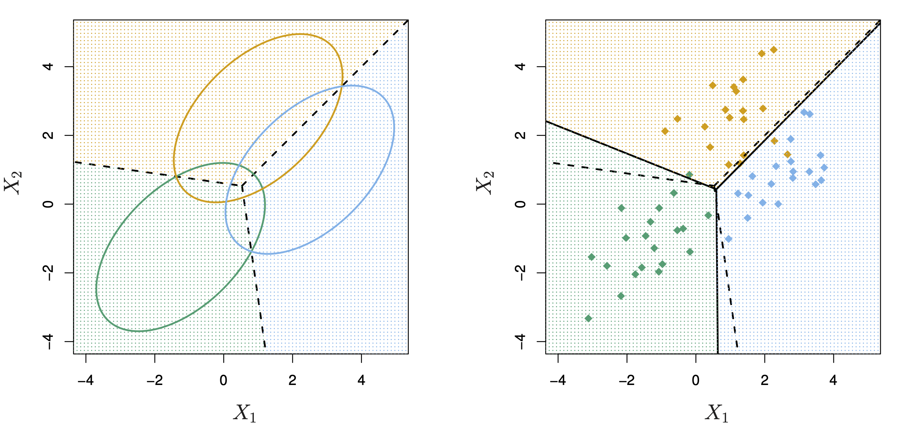
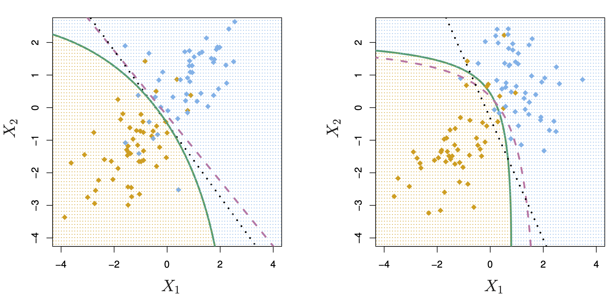
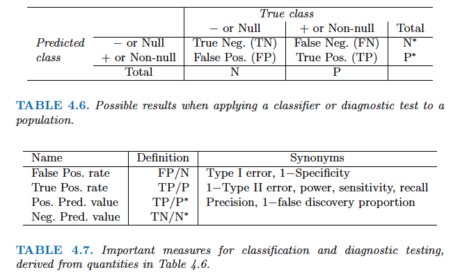

```{r}
#| include: false
set.seed(1)
library(MASS)     # lda, qda
library(ggplot2)
library(dplyr)
library(ISLR2)
```


---

## Linear regression recap

- Response $Y$ continuous
- Model: $Y=\beta_0+\beta^\top X + \epsilon$, $\epsilon\sim\mathcal{N}(0,\sigma^2\text{I})$
- Estimate $\beta_0,\beta$ by minimizing **residual sum of squares**:

$$
\mathcal{L}(\beta_0,\beta)=\sum_{i=1}^n (y_i - \beta_0 - \beta^\top x_i)^2
$$

---

## Risk minimization view:

- Loss function: squared error loss
- Expected loss (risk) over both $X$ and $Y$
$$
R(f)=E\big[(Y-f(X))^2\big]
$$
- Optimal predictor: regression function
$$
f^{opt}(x)=E[Y\mid X=x]
$$
- Empirical risk minimization: minimize average loss on training data
$$
\hat{R}(f)=\frac{1}{n}\sum_{i=1}^n (y_i - f(x_i))^2
$$
- Linear regression: $f(x)=\beta_0+\beta^\top x$, and $\hat\beta=\text{argmin}_{\beta} \hat{R}(f)$
- The bound between test error and train error
$$
\mathbb{E}\!\left[\mathrm{MSE}_{\mathrm{test}}-\mathrm{MSE}_{\mathrm{train}}\mid X\right]
= \frac{2\sigma^2 p}{N}.
$$
- Derived by assuming $X$ fixed, and averaging over training and test $Y$.

---

## Logistic regression recap

Binary classification:
$$
\Pr(Y=1\mid X=x)=\sigma(\beta_0+\beta^\top x),\quad
\sigma(t)=\frac{1}{1+e^{-t}}
$$

Linear log-odds:
$$
\log\frac{\Pr(Y=1\mid x)}{\Pr(Y=0\mid x)}=\beta_0+\beta^\top x
$$

Decision boundary: $\beta_0+\beta^\top x=0$ (linear)


---

## Loss function

- We use maximum likelihood to estimate the parameters. That is find $\beta_0, \ldots, \beta_p$ that maximizes the *likelihood* function
$$
\ell(\beta_0, \ldots, \beta_p) = \prod_{i:y_i=1} p(x_i) \prod_{i: y_i = 0} [1 - p(x_i)].
$$


- From a machine learning perspective, maximizing likelihood is the same as minimizing the **negative log-likelihood**, also called **log loss / cross-entropy**:
$$
\mathcal{L}(\beta)= -\frac{1}{n}\sum_{i=1}^n\Big[y_i\log p(x_i) + (1-y_i)\log(1-p(x_i))\Big].
$$

- This is a convex function in $\beta$, so we can use gradient descent or other optimization methods to find the global minimum efficiently. No closed-form solution like linear regression.


---

## Discriminant analysis

- Another approach for classification is to model the distribution of $X$ in each of the classes separately, and then use **Bayes theorem** to flip things around and obtain $\operatorname{Pr}(Y = j \mid X)$.
- When we use normal (Gaussian) distributions for each class, this leads to linear or quadratic discriminant analysis.
- However, this approach is quite general, and other distributions can be used as well. We will focus on normal distributions.

---

- Use **Bayes theorem**:
\begin{eqnarray*}
p_k(x) &=& \operatorname{Pr}(Y = k \mid X = x) \\
&=& \frac{\operatorname{Pr}(X = x, Y = k)}{\operatorname{Pr}(X = x)} \\
&=& \frac{\operatorname{Pr}(X = x \mid Y = k) \cdot \operatorname{Pr}(Y = k)}{\operatorname{Pr}(X = x)} \\
&=& \frac{\pi_k f_k(x)}{\sum_{\ell=1}^K \pi_\ell f_\ell(x)},
\end{eqnarray*}
where   
    - $f_k(x) = \operatorname{Pr}(X = x \mid Y = k)$ is the density of $X$ in class $k$  
    - $\pi_k = \operatorname{Pr}(Y = k)$ is the marginal or **prior** probability for class $k$. 

- We show

$$
\log\frac{\Pr(Y=1\mid x)}{\Pr(Y=0\mid x)}
=
\log\frac{\pi_1}{\pi_0}
+
\log\frac{\text{Pr}(x\mid Y = 1)}{\text{Pr}(x\mid Y = 0)}
$$

- Logistic regression: **postulates** the LHS is linear in $x$  
- LDA: chooses $p(x\mid y)$ so the **RHS becomes linear**

---

### Advantages of discriminant analysis.

- When the classes are well-separated, the parameter estimates for the logistic regression model are surprisingly unstable (separation or quasi-separation). Linear discriminant analysis does not suffer from this problem.
    
- If $n$ is small and the distribution of the predictors $X$ is approximately normal in each of the classes, the linear discriminant model is again more stable than the logistic regression model.


---

### Linear discriminant analysis  

Assume:
$$
X\mid (Y=k)\sim \mathcal{N}(\mu_k,\Sigma),
\qquad \Pr(Y=k)=\pi_k
$$
(shared covariance $\Sigma$ across classes). That is the class-conditional densities are
$$
f_k(x) = \frac{1}{(2\pi)^{p/2} |\boldsymbol{\Sigma}|^{1/2}} e^{- \frac{1}{2} (x - \mu_k)^T \boldsymbol{\Sigma}^{-1} (x - \mu_k)}.
$$

To classify $X=x$, we need to see which of $p_k(x)$ is big. Taking logs, and discarding terms that do not depend on $k$, we just need to assign $x$ to the class with the largest **discriminant score**
$$
\delta_k(x) = x^T \boldsymbol{\Sigma}^{-1} \mu_k - \frac{1}{2} \mu_k^T \boldsymbol{\Sigma}^{-1} \mu_k + \log \pi_k,
$$
which is a linear function in $x$!


---

- For example, in the one-dimensional setting, the normal density takes the form
$$
f_k(x) = \frac{1}{\sqrt{2\pi\sigma_k}} \exp\left(-\frac{1}{2\sigma_k^2}(x - \mu_k)^2\right)
$$
where $\mu_k$ and $\sigma_{k}^2$ are the mean and variance parameters for the $k$th class. We assume shared variance term across all $K$ classes, $\sigma_{1}^2=\ldots=\sigma_{K}^2 = \sigma^2$. 

- Then 
$$
p_k(x) = \frac{\pi_k \frac{1}{\sqrt{2\pi\sigma}} \exp\left(-\frac{1}{2\sigma^2}(x - \mu_k)^2\right)}{\sum_{l=1}^{K} \pi_l \frac{1}{\sqrt{2\pi\sigma}} \exp\left(-\frac{1}{2\sigma^2}(x - \mu_l)^2\right)}.
$$
- Taking the log of both sides and rearrange terms with $k$
$$
\delta_k = x \frac{\mu_k}{\sigma^2} - \frac{\mu_k^2}{2\sigma^2} + \log \pi_k.
$$ 

---

- The linear discriminant function $\delta_k(x)$ is a linear combination of the features $x_1, \ldots, x_p$.

- We estimate the unknown parameters $\pi_k$, $\mu_k$, and $\boldsymbol{\Sigma}$ by
\begin{eqnarray*}
\hat{\pi}_k &=& \frac{n_k}{n} \\
\hat{\mu}_k &=& \frac{1}{n_k} \sum_{i: y_i = k} x_i \\
\hat{\boldsymbol{\Sigma}} &=& \frac{1}{n-K} \sum_{k=1}^K \sum_{i: y_i = k} (x_i - \hat \mu_k)(x_i - \hat \mu_k)^T.
\end{eqnarray*}

- Once we have estimated $\hat \delta_k(x)$, we can turn these into class probabilities
$$
\hat{\operatorname{Pr}}(Y = k \mid X = x) = \frac{e^{\hat \delta_k(x)}}{\sum_{\ell=1}^K e^{\hat \delta_{\ell}(x)}}.
$$


---


::: {#fig-tradeoff-truth}
{width=700px height=350px}


Here $\pi_1 = \pi_2 = \pi_3 = 1/3$. The dashed lines are known as the Bayes decision boundaries. Were they known, they would yield the fewest misclassification errors, among all possible classifiers. The black line is the LDA decision boundary.

:::

---

- LDA on the credit `Default` data.

- Setup: train/test split (for later evaluation)

- Throughout the note we will sometimes fit models on the full dataset for **interpretation and visualization**.
But to evaluate *generalization*, we will later compare models on a held-out **test set**.

::: {.panel-tabset}

#### R

```{r}
set.seed(1)
n <- nrow(Default)
idx <- sample.int(n, size = floor(0.8*n))

Default_train <- Default[idx, ]
Default_test  <- Default[-idx, ]

# Class balance (important for interpreting accuracy)
prop.table(table(Default_train$default))
```

:::

---

::: {.panel-tabset}


#### R

```{r}

# Fit LDA
lda_mod <- lda(
  default ~ balance + income + student, 
  data = Default
  )
lda_mod

# Predicted labels from LDA
lda_pred = predict(lda_mod, Default)

# Confusion matrix
(lda_cfm = table(Predicted = lda_pred$class, Default = Default$default))

```

Overall training accuracy of LDA (using 0.5 as threshold) is
```{r}
# Accuracy
(lda_cfm['Yes', 'Yes'] + lda_cfm['No', 'No']) / sum(lda_cfm)
```

The area-under-ROC curve (AUC) of LDA is
```{r}
# AUC
library(pROC)
(lda_auc = roc(Default$default, lda_pred$posterior[, 2])$auc)
```


:::


---

### Quadratic discriminant analysis (QDA)

- In LDA, the normal distribution for each class shares the same covariance $\boldsymbol{\Sigma}$.

- If we assume that the normal distribution for class $k$ has covariance $\boldsymbol{\Sigma}_k$, then it leads to the **quadratic discriminant analysis** (QDA).

- The discriminant function takes the form
$$
\delta_k(x) = - \frac{1}{2} (x - \mu_k)^T \boldsymbol{\Sigma}_k^{-1} (x - \mu_k) + \log \pi_k - \frac{1}{2} \log |\boldsymbol{\Sigma}_k|,
$$
which is a quadratic function in $x$.

::: {#fig-lda-vs-qda}

<p align="center">
{width=700px height=350px}
</p>

The Bayes (purple dashed), LDA (black dotted), and QDA (green solid) decision boundaries for a two-class problem. Left: $\boldsymbol{\Sigma}_1 = \boldsymbol{\Sigma}_2$. Right: $\boldsymbol{\Sigma}_1 \ne \boldsymbol{\Sigma}_2$.
:::

---

::: {.panel-tabset}

#### R

```{r}
# Fit QDA
qda_mod <- qda(
  default ~ balance + income + student, 
  data = Default
  )
qda_mod

# Predicted probabilities from QDA
qda_pred = predict(qda_mod, Default)

# Confusion matrix
(qda_cfm = table(Predicted = qda_pred$class, Default = Default$default))
```

Overall training accuracy of QDA (using 0.5 as threshold) is
```{r}
# Accuracy
(qda_cfm['Yes', 'Yes'] + qda_cfm['No', 'No']) / sum(qda_cfm)
```

The area-under-ROC curve (AUC) of QDA is
```{r}
(auc_qda = roc(
  Default$default,
  qda_pred$posterior[, 'Yes']
)$auc)
```

:::

---

### Naive Bayes

- If we assume $f_k(x) = \prod_{j=1}^p f_{jk}(x_j)$ (conditional independence model) in each class, we get **naive Bayes**. 

    For Gaussian this means the $\boldsymbol{\Sigma}_k$ are diagonal.

- Naive Bayes is useful when $p$ is large (LDA and QDA break down).

- Can be used for $mixed$ feature vectors (both continuous and categorical). If $X_j$ is qualitative, replace $f_{kj}(x_j)$ with probability mass function (histogram) over discrete
categories.

- Despite strong assumptions, naive Bayes often produces good classification results.


---

::: {.panel-tabset}


#### R
- Note : For each categorical variable a table giving, for each attribute level, the conditional probabilities given the target class. For each numeric variable, a table giving, for each target class, mean and standard deviation of the (sub-)variable.
```{r}
library(e1071)

# Fit Naive Bayes classifier
nb_mod <- naiveBayes(
  default ~ balance + income + student, 
  data = Default
  )

# Predicted labels from Naive Bayes
nb_pred = predict(nb_mod, Default)

# Confusion matrix
(nb_cfm = table(Predicted = nb_pred, Default = Default$default))
```

Overall training accuracy of Naive Bayes classifier (using 0.5 as threshold) is
```{r}
# Accuracy
(nb_cfm['Yes', 'Yes'] + nb_cfm['No', 'No']) / sum(nb_cfm)
```

The area-under-ROC curve (AUC) of NB is
```{r}
(auc_nb = roc(
  Default$default, 
  predict(nb_mod, Default, type = "raw")[, 2]
  )$auc)
```
:::

---

## $K$-nearest neighbor (KNN) classifier

- KNN is a nonparametric classifier. 

- Given a positive integer $K$ and a test observation $x_0$, the KNN classifier first identifies the $K$ points in the training data that are closest to $x_0$, represented by $\mathcal{N}_0$. It estimates the conditional probability by
$$
\operatorname{Pr}(Y=j \mid X = x_0) = \frac{1}{K} \sum_{i \in \mathcal{N}_0} I(y_i = j)
$$
and then classifies the test observation $x_0$ to the class with the largest probability.

- We illustrate KNN with $K=5$ on the credit default data.


---

::: {.panel-tabset}

#### R

```{r}
library(class)

X_default <- Default %>% 
  mutate(
    x_student = as.integer(student == "Yes"),
    # KNN is distance-based: scaling features is essential
    balance_z = as.numeric(scale(balance)),
    income_z = as.numeric(scale(income))
  ) %>%
  dplyr::select(x_student, balance_z, income_z)

# KNN prediction with K = 5
knn_pred <- knn(
  train = X_default, 
  test = X_default,
  cl = Default$default,
  k = 5
  )

# Confusion matrix
(knn_cfm = table(Predicted = knn_pred, Default = Default$default))
```

Overall training accuracy of KNN classifier with $K=5$ (using 0.5 as threshold) is
```{r}
# Accuracy
(knn_cfm['Yes', 'Yes'] + knn_cfm['No', 'No']) / sum(knn_cfm)
```

The area-under-ROC curve (AUC) of KNN ($K=5$) is
```{r}
# AUC
knn_mod <- knn(
  train = X_default, 
  test = X_default,
  cl = Default$default,
  prob = TRUE,
  k = 5
  )
prob_win <- attr(knn_mod, "prob")
# knn() returns the vote fraction for the winning class; convert to P(Yes)
knn_pred_prob <- ifelse(knn_mod == "Yes", prob_win, 1 - prob_win) 

(knn_auc = auc(
  Default$default,
  knn_pred_prob
))
```
:::

---

## Prediction and evaluation 

In machine learning, the key question is: **how well does the classifier generalize to new data?**

- Training metrics can be overly optimistic.
- For imbalanced problems (like credit default), **accuracy can be misleading**.
- Prefer threshold-free metrics like **ROC-AUC**, and probability-focused metrics like **log loss**.

There are two types of classification errors:

- **False positive rate (FPR):** fraction of negatives predicted as positive.
- **False negative rate (FNR):** fraction of positives predicted as negative.

{width=700px height=350px}


---

::: {.panel-tabset}

#### R

```{r, message=F, warning=F}
library(MASS)
library(e1071)
library(class)
library(pROC)
library(tidyverse)

# Helper: compute common metrics on a test set
metrics_binary <- function(y_true, y_pred, p_yes) {
  y_true <- factor(y_true, levels = c("No", "Yes"))
  y_pred <- factor(y_pred, levels = c("No", "Yes"))
  cfm <- table(Predicted = y_pred, True = y_true)

  acc <- sum(diag(cfm)) / sum(cfm)
  tpr <- cfm["Yes", "Yes"] / sum(cfm[, "Yes"])  # sensitivity / recall
  tnr <- cfm["No", "No"] / sum(cfm[, "No"])    # specificity
  bacc <- 0.5 * (tpr + tnr)
  fpr <- cfm["Yes", "No"] / sum(cfm[, "No"])
  fnr <- cfm["No", "Yes"] / sum(cfm[, "Yes"])

  # Log loss (clip probs for numerical stability)
  p <- pmin(pmax(p_yes, 1e-15), 1 - 1e-15)
  ll <- -mean(ifelse(y_true == "Yes", log(p), log(1 - p)))

  # ROC-AUC
  auc_val <- as.numeric(auc(roc(y_true, p_yes)))

  c(ACC = acc, BACC = bacc, FPR = fpr, FNR = fnr, LogLoss = ll, AUC = auc_val)
}

# --- Fit models on training set (for evaluation) ---
logit_tt <- glm(default ~ balance + income + student, family = binomial, data = Default_train)
lda_tt   <- lda(default ~ balance + income + student, data = Default_train)
qda_tt   <- qda(default ~ balance + income + student, data = Default_train)
nb_tt    <- naiveBayes(default ~ balance + income + student, data = Default_train)

# KNN: scale numeric features using training mean/sd
bal_mu <- mean(Default_train$balance); bal_sd <- sd(Default_train$balance)
inc_mu <- mean(Default_train$income);  inc_sd <- sd(Default_train$income)

X_train_knn <- Default_train %>%
  mutate(
    x_student = as.integer(student == "Yes"),
    balance_z = (balance - bal_mu) / bal_sd,
    income_z  = (income  - inc_mu) / inc_sd
  ) %>%
  dplyr::select(x_student, balance_z, income_z)

X_test_knn <- Default_test %>%
  mutate(
    x_student = as.integer(student == "Yes"),
    balance_z = (balance - bal_mu) / bal_sd,
    income_z  = (income  - inc_mu) / inc_sd
  ) %>%
  dplyr:: select(x_student, balance_z, income_z)

# --- Predict on test set ---
logit_p <- predict(logit_tt, newdata = Default_test, type = "response")
logit_y <- ifelse(logit_p > 0.5, "Yes", "No")

lda_pr  <- predict(lda_tt, newdata = Default_test)
lda_p   <- lda_pr$posterior[, "Yes"]
lda_y   <- lda_pr$class

qda_pr  <- predict(qda_tt, newdata = Default_test)
qda_p   <- qda_pr$posterior[, "Yes"]
qda_y   <- qda_pr$class

nb_p    <- predict(nb_tt, newdata = Default_test, type = "raw")[, "Yes"]
nb_y    <- predict(nb_tt, newdata = Default_test, type = "class")

knn_y <- knn(train = X_train_knn, test = X_test_knn, cl = Default_train$default,
             k = 5, prob = TRUE)
prob_win <- attr(knn_y, "prob")
knn_p <- ifelse(knn_y == "Yes", prob_win, 1 - prob_win)

# Null classifier (majority class)
null_y <- rep("No", nrow(Default_test))
null_p <- rep(0, nrow(Default_test))

models <- tibble(
  Classifier = c("Null", "Logit", "LDA", "QDA", "NB", "KNN"),
  y_pred = list(null_y, logit_y, lda_y, qda_y, nb_y, knn_y),
  p_yes  = list(null_p, logit_p, lda_p, qda_p, nb_p, knn_p)
)

results <- models %>%
  mutate(
    Metrics = map2(y_pred, p_yes, ~metrics_binary(Default_test$default, .x, .y))
  ) %>%
  unnest_wider(Metrics) %>%
  arrange(desc(AUC))

results
```
:::

---

## Comparison between classifiers

- For a two-class problem, we can show that for LDA,
$$
\log \left( \frac{p_1(x)}{1 - p_1(x)} \right) = \log \left( \frac{p_1(x)}{p_2(x)} \right) = c_0 + c_1 x_1 + \cdots + c_p x_p.
$$
So it has the same form as logistic regression. The difference is in how the parameters are estimated. 

- Logistic regression uses the conditional likelihood based on $\operatorname{Pr}(Y \mid X)$ (known as **discriminative learning**). 

    LDA, QDA, and Naive Bayes use the full likelihood based on $\operatorname{Pr}(X, Y)$ (known as **generative learning**).
    
- Despite these differences, in practice the results are often very similar.

- Logistic regression can also fit quadratic boundaries like QDA, by explicitly including quadratic terms in the model.

- Logistic regression is very popular for classification, especially when $K = 2$.

- LDA is useful when $n$ is small, or the classes are well separated, and Gaussian assumptions are reasonable. Also when $K > 2$.

- Naive Bayes is useful when $p$ is very large.

- LDA is a special case of QDA. 

- Under normal assumption, Naive Bayes leads to linear decision boundary, thus a special case of LDA. 

- KNN classifier is non-parametric and can dominate LDA and logistic regression when the decision boundary is highly nonlinear, provided that $n$ is very large and $p$ is small.

- See ISL Section 4.5 for theoretical and empirical comparisons of logistic regression, LDA, QDA, NB, and KNN.


