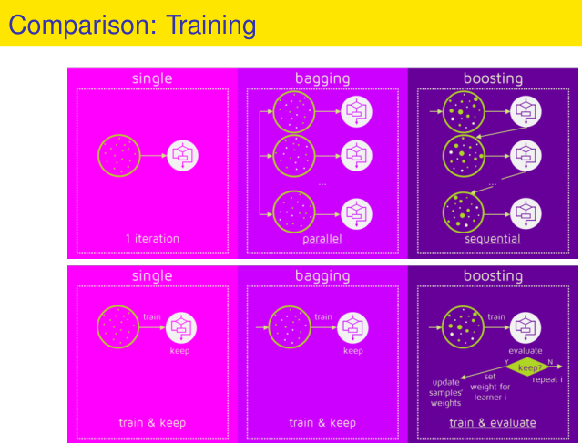
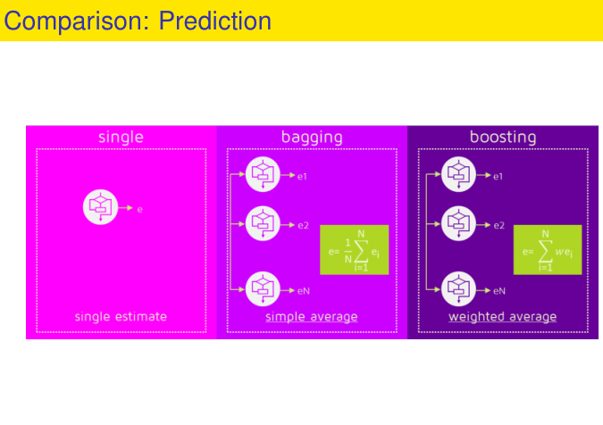

Credit: This note heavily uses material from the books [_An Introduction to Statistical Learning: with Applications in R_](https://www.statlearning.com/) (ISL2) and [_Elements of Statistical Learning: Data Mining, Inference, and Prediction_](https://hastie.su.domains/ElemStatLearn/) (ESL2).

Display system information for reproducibility.

::: {.panel-tabset}
## R

```{r}
sessionInfo()
```

## Python

```{python}
import IPython
print(IPython.sys_info())
```

:::

# Decision trees 

- In this lecture, we describe **tree-based** methods for regression and classification.

- These involve **stratifying** or **segmenting** the predictor space into a number of simple regions.

- Since the set of splitting rules used to segment the predictor space can be summarized in a tree, these types of approaches are known as **decision-tree** methods.

 
## Pros and cons of decision tree

- Tree-based methods are simple and useful for interpretation.

- However they typically are not competitive with the best supervised learning approaches in terms of prediction accuracy.

- Hence we also discuss **bagging**, **random forests**, and **boosting**. These methods grow multiple trees which are then combined to yield a single consensus prediction.

- Combining a large number of trees can often result in dramatic improvements in prediction accuracy, at the expense of some loss of interpretation.

## The basics of decision trees

- Decision trees can be applied to both regression and classification problems.

- We first consider regression problems, and then move on to classification.

## Baseball player salary data `Hitter`.

::: {.panel-tabset}

#### R 
```{r}
library(tidyverse)
library(ISLR2)

ggplot(Hitters, aes(x = Years, y = Hits, color = Salary)) +
  geom_point() +
  theme_minimal()

Hitters %>% filter(Hits < 10)
```

#### Python

Load `Hitters` data:
```{python}
# Load the pandas library
import pandas as pd
# Load numpy for array manipulation
import numpy as np
# Load seaborn plotting library
import seaborn as sns
import matplotlib.pyplot as plt

# Set font sizes in plots
sns.set(font_scale = 2)
# Display all columns
pd.set_option('display.max_columns', None)

Hitters = pd.read_csv("./slides/data/Hitters.csv")
Hitters
```

Visualize:
```{python}
plt.figure()
sns.relplot(
  data = Hitters,
  x = 'Years',
  y = 'Hits',
  hue = 'Salary'
);
plt.show()
```

Who are those two outliers?
```{python}
#| code-fold: false
Hitters[Hitters['Hits'] < 10]
```

:::

- A simple decision tree for this data:

<p align="center">
{width=500px height=700px}
</p>

- Overall, the tree stratifies or segments the players into three regions of predictor space:
\begin{eqnarray*}
R_1 &=& \{ X \mid \text{Years} < 4.5\} \\
R_2 &=& \{ X \mid \text{Years} \ge 4.5, \text{Hits} < 117.5\} \\
R_3 &=& \{ X \mid \text{Years} \ge 4.5, \text{Hits} \ge 117.5\}
\end{eqnarray*}

<p align="center">
{width=500px height=500px}
</p>

- Terminology:

    - In keeping with the **tree** analogy, the regions $R_1$, $R_2$, and $R_3$ are known as **terminal nodes**. 
    
    - Decision trees are typically drawn **upside down**, in the sense that the leaves are at the bottom of the tree.

    - The points along the tree where the predictor space is split are referred to as **internal nodes**.
    
    - In the `Hitters` tree, the two internal nodes are indicated by the `Years<4.5` and `Hits<117.5`.
    
- Interpretation of decision tree results:

    - `Years` is the most important factor in determining `Salary`, and players with less experience earn lower salaries than more experienced players.  
    
    - Given that a player is less experienced, the number of `Hits` that he made in the previous year seems to play little role in his `Salary`.
    
    - But among players who have been in the major leagues for five or more years, the number of `Hits` made in the previous year does affect `Salary`, and players who made more `Hits` last year tend to have higher salaries.

    - Surely an over-simplification, but compared to a regression model, it is easy to display, interpret and explain.
    
## Tree-building process

- We divide the predictor space into J distinct and non-overlapping regions: $R_1, R_2, \ldots, R_J$.

- For every observation that falls into the region $R_j$, we make the same prediction, which is simply the mean of the response values for the training observations in $R_j$.

- In theory, the regions could have any shape. However, we choose to divide the predictor space into high-dimensional rectangles, or **boxes**, for simplicity and for ease of interpretation of the resulting predictive model.

- The goal is to find boxes $R_1, \ldots, R_J$ that minimize the RSS, given by
$$
\sum_{j=1}^J \sum_{i \in R_j} (y_i - \hat y_{R_j})^2,
$$
where $\hat y_{R_j}$ is the mean response for the training observations within the $j$th box.

- Unfortunately, it is computationally infeasible to consider every possible partition of the feature space into $J$ boxes.

- For this reason, we take a **top-down**, **greedy** approach that is known as recursive binary splitting.

    - The approach is **top-down** because it begins at the top of the tree and then successively splits the predictor space; each split is indicated via two new branches further down on the tree.

    - It is **greedy** because at each step of the tree-building
process, the **best** split is made at that particular step, rather than looking ahead and picking a split that will lead to a better tree in some future step.

- We first select the predictor $X_j$ and the cutpoint $s$ such
that splitting the predictor space into the regions $\{X \mid X_j < s\}$ and $\{X \mid X_j \ge s\}$ leads to the greatest possible reduction in RSS.

- Next, we repeat the process, looking for the best predictor
and best cutpoint in order to split the data further so as to
minimize the RSS within each of the resulting regions.

- However, this time, instead of splitting the entire predictor
space, we split one of the two previously identified regions.
We now have three regions.

- Again, we look to split one of these three regions further,
so as to minimize the RSS. The process continues until a
stopping criterion is reached; for instance, we may continue
until no region contains more than five observations.


::: {.callout-note appearance="minimal"}
### Goal
Partition the predictor space into rectangular regions (boxes) and predict each region by the **mean response**.

### Notation
- $S$: index set of points in the current region  
- $\hat{y}_S = \frac{1}{|S|}\sum_{i\in S} y_i$: mean response in region $S$  
- $RSS(S) = \sum_{i\in S}(y_i-\hat{y}_S)^2$: residual sum of squares in region $S$

### Algorithm
1. **TrainTree($X, y, \Theta$)**
   1. $S \leftarrow \{1,2,\dots,n\}$
   2. return **GrowNode($S$, depth = 0)**

2. **GrowNode($S$, depth)**
   1. $\hat{y}_S \leftarrow \frac{1}{|S|}\sum_{i\in S} y_i$ *(leaf prediction)*
   2. If **Stop($S$, depth, $\Theta$)**, return **Leaf(pred = $\hat{y}_S$)**
   3. $(j^*, s^*, S_L, S_R, \Delta) \leftarrow$ **BestSplit($S$)**
   4. If **no valid split** (or $\Delta$ too small), return **Leaf(pred = $\hat{y}_S$)**
   5. Create **DecisionNode(feature = $j^*$, threshold = $s^*$)**
   6. node.left  $\leftarrow$ **GrowNode($S_L$, depth+1)**
   7. node.right $\leftarrow$ **GrowNode($S_R$, depth+1)**
   8. return node

3. **BestSplit($S$)**
   1. Compute $RSS(S)$
   2. For each feature $j \in \{1,\dots,p\}$:
      1. For each candidate cutpoint $s$ from feature $j$ values in $S$:
         1. $S_L = \{i\in S : x_{ij} < s\}$, $S_R = \{i\in S : x_{ij} \ge s\}$
         2. Skip if $S_L$ or $S_R$ is empty
         3. Compute $\hat{y}_{S_L}$, $\hat{y}_{S_R}$
         4. $RSS_{\text{split}} =
            \sum_{i\in S_L}(y_i-\hat{y}_{S_L})^2 +
            \sum_{i\in S_R}(y_i-\hat{y}_{S_R})^2$
         5. Keep the split with smallest $RSS_{\text{split}}$
   3. Return the best $(j^*, s^*, S_L, S_R)$ and
      $\Delta = RSS(S) - RSS_{\text{best split}}$

4. **Stop($S$, depth, $\Theta$)** *(example stopping rules)*
   - return TRUE if any:
     - depth $\ge \Theta.\text{maxDepth}$
     - $|S| < \Theta.\text{minSamplesSplit}$
     - $\mathrm{Var}(\{y_i:i\in S\}) = 0$
     - best decrease $\Delta < \Theta.\text{minRssDecrease}$
     - $|S_L| < \Theta.\text{minSamplesLeaf}$ or $|S_R| < \Theta.\text{minSamplesLeaf}$
:::

```{=html}
<style>
.callout-note ol { margin-left: 1.1rem; }
.callout-note ol ol { margin-left: 1.4rem; }
.callout-note li { margin: 0.25rem 0; }
</style>
```


## Predictions

- We predict the response for a given test observation using the mean of the training observations in the region to which that test observation belongs.

::: {#fig-decision-tree}

<p align="center">
{width=500px height=600px}
</p>

Top left: A partition of two-dimensional feature space that
could not result from recursive binary splitting. Top right: The output of recursive binary splitting on a two-dimensional example. Bottom left: A tree corresponding to the partition in the top right panel. Bottom right: A perspective plot of the prediction surface corresponding to that tree.

:::

## Prunning

- The process described above may produce good predictions on the training set, but is likely to **overfit** the data, leading to poor test set performance.

- A smaller tree with fewer splits (that is, fewer regions $R_1, \ldots, R_J$) might lead to lower variance and better interpretation at the cost of a little bias.

- One possible alternative to the process described above is to grow the tree only so long as the decrease in the RSS due to each split exceeds some (high) threshold. This strategy will result in smaller trees, but is too **short-sighted**: a seemingly worthless split early on in the tree might be followed by a very good split.

- A better strategy is to grow a very large tree $T_0$, and then prune it back in order to obtain a **subtree**.

- **Cost complexity pruning**, aka **weakest link pruning**, is used to do this.

- we consider a sequence of trees indexed by a nonnegative tuning parameter $\alpha$. For each value of $\alpha$ there corresponds a subtree $T \subset T_0$ such that
$$
\sum_{m=1}^{|T|} \sum_{i: x_i \in R_m} (y_i - \hat y_{R_m})^2 + \alpha |T|
$$
is as small as possible. Here $|T|$ indicates the number of terminal nodes of the tree $T$, $R_m$ is the rectangle (i.e. the subset of predictor space) corresponding to the $m$th terminal node, and $\hat y_{R_m}$ is the mean of the training observations in $R_m$.

- The tuning parameter $\alpha$ controls a trade-off between the subtree's complexity and its fit to the training data.

- We select an optimal value $\hat \alpha$ using cross-validation.

- We then return to the full data set and obtain the subtree corresponding to $\hat \alpha$.

## Summary: tree algorithm

1. Use recursive binary splitting to grow a large tree on the training data, stopping only when each terminal node has fewer than some minimum number of observations.

2. Apply cost complexity pruning to the large tree in order to obtain a sequence of best subtrees, as a function of $\alpha$.

3. Use $K$-fold cross-validation to choose $\alpha$. For each
$k = 1,\ldots,K$:

    3.1 Repeat Steps 1 and 2 on the $(K-1)/K$ the fraction of the training data, excluding the $k$th fold.  
    
    3.2 Evaluate the mean squared prediction error on the data in the left-out $k$th fold, as a function of $\alpha$.
    
    Average the results, and pick $\alpha$ to minimize the average error.
    
4. Return the subtree from Step 2 that corresponds to the chosen value of $\alpha$.

## `Baseball` example (regression tree)

[Workflow: pruning a regression tree](https://ucla-biostat-274.github.io/2026winter/slides/08-tree/workflow_regtree.html).

## Classification trees

- Very similar to a regression tree, except that it is used to predict a qualitative response rather than a quantitative one.

- For a classification tree, we predict that each observation belongs to the **most commonly occurring class** of training observations in the region to which it belongs.

- Just as in the regression setting, we use recursive binary splitting to grow a classification tree.

- In the classification setting, RSS cannot be used as a criterion for making the binary splits. A natural alternative to RSS is the **classification error rate**. This is simply the fraction of the training observations in that region that do not belong to the most common class:
$$
E = 1 - \max_k (\hat p_{mk}).
$$
Here $\hat p_{mk}$ represents the proportion of training observations in the $m$th region that are from the $k$th class.

- However classification error is not sufficiently sensitive for
tree-growing, and in practice two other measures are preferable.

- The **Gini index** is defined by
$$
G = \sum_{k=1}^K \hat p_{mk}(1 - \hat p_{mk}),
$$
a measure of total variance across the $K$ classes. The Gini index takes on a small value if all of the $\hat p_{mk}$'s are close to zero or one. For this reason the Gini index is referred to as a measure of node **purity**. A small value indicates that a node contains predominantly observations from a single class.

- An alternative to the Gini index is **cross-entropy**, given by
$$
D = - \sum_{k=1}^K \hat p_{mk} \log \hat p_{mk}.
$$
It turns out that the Gini index and the cross-entropy are very similar numerically.

## `Heart` data example (classification tree)

[Workflow: pruning a classification tree](https://ucla-biostat-274.github.io/2026winter/slides/08-tree/workflow_classtree.html).

## Tree versus linear models

::: {#fig-decision-tree}

<p align="center">
{width=500px height=600px}
</p>

Top Row: True linear boundary; Bottom row: true non-linear
boundary. Left column: linear model; Right column: tree-based model

:::

## Pros and cons of decision trees

Advantages:

1. Trees are very easy to explain to people. In fact, they are even easier to explain than linear regression!

2. Some people believe that decision trees more closely mirror human decision-making than other regression and classification approaches we learnt in this course.

3. Trees can be displayed graphically, and are easily interpreted even by a non-expert (especially if they are small).

4. Trees can easily handle qualitative predictors without the need to create dummy variables. XGBoost (version 1.5+) can now also handle categorical variables directly.

Disadvantages:

1. Unfortunately, trees generally do not have the same level of predictive accuracy as some of the other regression and classification approaches.

2. Additionally, trees can be very non-robust. In other words, a small change in the data can cause a large change in the final estimated tree.

**Ensemble methods** such as bagging, random forests, and boosting solve these issues.

# Bagging

> Bagging is like taking a vote among many decent-but-imperfect experts.
Instead of trusting one model that might be unstable, we train lots of models on slightly different versions of the data and average their predictions.
The mistakes they make randomly tend to cancel out, while the real patterns show up consistently — so the final result is more reliable.

- **Bootstrap aggregation**, or **bagging**, is a general-purpose procedure for reducing the variance of a statistical learning method. It is particularly useful and frequently used in the context of decision trees.

- Recall that given a set of $n$ independent observations $Z_1, \ldots, Z_n$, each with variance $\sigma^2$, the variance of the mean $\bar Z$ of the observations is given by $\sigma^2 / n$. In other words, averaging a set of observations reduces variance. Of course, this is not practical because we generally do not have access to multiple training sets.

- Instead, we can bootstrap, by taking repeated samples from the (single) training data set.

- In this approach we generate $B$ different bootstrapped training data sets. We then train our method on the $b$th bootstrapped training set in order to get $\hat f^{*b}(x)$, the prediction at a point $x$. We then average all the predictions to obtain
$$
\hat f_{\text{bag}}(x) = \frac{1}{B} \sum_{b=1}^B \hat f^{*b}(x).
$$
This is called **bagging**.

- These trees are grown deep, and are not pruned.

- The above prescription applied to regression trees.

- For classification trees: for each test observation, we record the class predicted by each of the $B$ trees, and take a majority vote: the overall prediction is the most commonly occurring class among the $B$ predictions.

::: {#fig-bagging-heart-data}

<p align="center">
{width=500px height=500px}
</p>

The test error (black and orange) is shown as a function of $B$, the number of bootstrapped training sets used. Random forests were applied with $m = \sqrt{p}$. The dashed line indicates the test error resulting from a single classification tree. The green and blue traces show the OOB error, which in this case is considerably lower.

:::

## Out-of-Bag (OOB) error estimation

- There is a very straightforward way to estimate the test error of a bagged model.

- Recall that the key to bagging is that trees are repeatedly fit to bootstrapped subsets of the observations. Each bagged tree makes use of around two-thirds of the observations (HW3).

- The remaining one-third of the observations not used to fit a given bagged tree are referred to as the **out-of-bag** (OOB) observations.

- We can predict the response for the $i$th observation using each of the trees in which that observation was OOB. This will yield around $B/3$ predictions for the $i$th observation, which we average.

- This estimate is essentially the LOO cross-validation error for bagging, if $B$ is large.

# Random forests

- **Random forests** provide an improvement over bagging by a small tweak that **decorrelates** the trees. This reduces the variance when we average the trees.

- As in bagging, we build a number of decision trees on bootstrapped training samples.

- But when building these decision trees, each time a split in a tree is considered, a **random selection of $m$ predictors** is chosen as split candidates from the full set of $p$ predictors. The split is allowed to use only one of those $m$ predictors.

- A fresh selection of $m$ predictors is taken at each split, and typically we choose $m \approx \sqrt{p}$ (4 out of the 13 for the `Heart` data).

- Gene expression data.

::: {#fig-random-forest-gene-expression}

<p align="center">
{width=500px height=500px}
</p>

Results from random forests for the fifteen-class gene expression data set with $p=500$ predictors. The test error is displayed as a function of the number of trees. Each colored line corresponds to a different value of $m$, the number of predictors available for splitting at each interior tree node. Random forests ($m < p$) lead to a slight improvement over bagging ($m = p$). A single classification tree has an error rate of 45.7\%.

:::

## `Baseball` example (random forest for prediction)

[Workflow: random forest for regression](https://ucla-biostat-274.github.io/2026winter/slides/08-tree/workflow_rf_reg.html).

## `Heart` example (random forest for classification)

[Workflow: random forest for classification](https://ucla-biostat-274.github.io/2026winter/slides/08-tree/workflow_rf_class.html).

## Many extensions of random forests
- Random forests can be adapted to survival analysis ([random survival forests](https://projecteuclid.org/journals/annals-of-applied-statistics/volume-2/issue-3/Random-survival-forests/10.1214/08-AOAS169.full)).
- [Individualized treatment rules (ITR)](https://hua-zhou.github.io/media/pdf/DoubledayZhouFuZhou18IndividualizedTreatmentTrees.pdf) via classification forests.
- [Causal forests](https://grf-labs.github.io/grf/reference/causal_forest.html) for estimating heterogeneous treatment effects.

# Boosting

## Introduction to boosting

- Suggested reading, Schapire, R. E. and Y. Freund (2012). [Boosting: Foundations and Algorithms](https://direct.mit.edu/books/oa-monograph/5342/BoostingFoundations-and-Algorithms). MIT Press.

- **Boosting** is an ensemble method that builds a strong predictor by combining many **weak learners** (for trees: usually **small/shallow trees**) in a **sequential** way.

- Compared with bagging / random forests:

  - **Bagging / RF:** trees are trained (approximately) **independently** and then averaged/voted → mainly reduces **variance**.

  - **Boosting:** trees are trained **one after another**, each correcting the mistakes of the current ensemble → mainly reduces **bias** (and can also reduce variance with regularization).

> Boosting is like coaching a team: each new learner studies the mistakes of the current ensemble and tries to fix them.  
> The final predictor is a **weighted committee vote**.

- Compared with bagging / random forests:

  - **Bagging / RF:** trees are trained (approximately) **independently** and then averaged/voted → mainly reduces **variance**.

  - **Boosting:** trees are trained **one after another**, each correcting the mistakes of the current ensemble → mainly reduces **bias** (and can also reduce variance with regularization).


{fig-align="center" width="85%"}

{fig-align="center" width="85%"}


- In tree boosting, we build an additive model
  $$
  \hat f(x) = \sum_{b=1}^B \nu \, h_b(x),
  $$
  where each $h_b$ is a **small regression tree**, and $\nu \in (0,1]$ is the **learning rate** (shrinkage).

## Why boosting tends to work well

- Each new tree focuses on what the current model is still getting wrong:

  - For **squared error regression**, “what’s wrong” = **residuals**.

  - For general losses, “what’s wrong” = **negative gradient** of the loss (see Gradient Boosting below).

- Boosting is powerful because:

  - It builds complex functions by **adding simple pieces** (small trees).

  - It learns **slowly** (with shrinkage and early stopping), which often generalizes well.

- The cost: boosting is less interpretable than a single tree, and can overfit if not regularized (but typically **overfits slowly**).

## AdaBoost (classification boosting idea)

- AdaBoost is historically important and gives great intuition: “re-weight the hard cases.”

- We maintain weights $w_i$ over training points. After each weak learner, misclassified points get **higher weight** so the next learner focuses on them.

- Final prediction is a **weighted vote** of the weak learners.

::: {.callout-note appearance="minimal"}
### AdaBoost (binary classification) (ESL Ch. 10)

Assume labels $y_i \in \{-1, +1\}$ and weak learners $f_b(x)\in\{-1,+1\}$.

1. Initialize weights: $w_i^{(1)} \leftarrow 1/n$.
2. For $b=1,\dots,B$:
   1. Fit a weak classifier $f_b$ on the weighted data.
   2. Compute weighted error:
      $$
      \epsilon_b = \sum_{i=1}^n w_i^{(b)} \mathbf{1}\{y_i \ne f_b(x_i)\}.
      $$
   3. Set learner weight:
      $$
      \alpha_b = \frac{1}{2}\log\left(\frac{1-\epsilon_b}{\epsilon_b}\right).
      $$
   4. Update weights (then renormalize so $\sum_i w_i^{(b+1)}=1$):
      $$
      w_i^{(b+1)} \propto w_i^{(b)} \exp\!\big(-\alpha_b y_i f_b(x_i)\big).
      $$
3. Output:
   $$
   F_B(x)=\sum_{b=1}^B \alpha_b f_b(x), \qquad \hat y(x)=\mathrm{sign}(F_B(x)).
   $$
:::

- Modern “tree boosting” is usually presented as **gradient boosting** (next section), which generalizes AdaBoost and works for many loss functions.

## Gradient Boosting Trees (GBT)

- **Gradient boosting** views learning as minimizing an empirical risk:
  $$
  \min_f \sum_{i=1}^n L(y_i, f(x_i)),
  $$
  where $L$ is a loss function (squared error, logistic loss, etc.).

- It performs a kind of **gradient descent in function space**, where each step adds a new weak learner (tree) in the direction that most decreases the loss.

### Regression boosting as a special case (squared error)

- If $L(y, f)=\frac12(y-f)^2$, then the negative gradient equals the residual:
  $$
  -\frac{\partial L}{\partial f}(y_i, f(x_i)) = y_i - f(x_i).
  $$

- Therefore, gradient boosting reduces to “fit a small tree to the residuals, add it to the model.”

::: {.callout-note appearance="minimal"}
### Boosting for regression trees (squared error)

1. Initialize $\hat f_0(x)=\bar y$.
2. For $b=1,\dots,B$:
   1. Compute residuals: $r_{ib} = y_i - \hat f_{b-1}(x_i)$.
   2. Fit a tree $h_b$ (with depth / splits controlled) to $(X, r_b)$.
   3. Update: $\hat f_b(x) \leftarrow \hat f_{b-1}(x) + \nu \, h_b(x)$.
3. Output: $\hat f_B(x)$.
:::

### General Gradient Boosting (any differentiable loss)

- For a general loss $L$, we compute the **pseudo-residuals** (negative gradients):
  $$
  r_{ib} = -\left.\frac{\partial L(y_i, f(x_i))}{\partial f(x_i)}\right|_{f=\hat f_{b-1}}.
  $$

- Then we fit a tree to these pseudo-residuals and add it to the model (with shrinkage).

::: {.callout-note appearance="minimal"}
### Gradient Boosting Trees (generic loss) — algorithm

1. Initialize:
   $$
   \hat f_0(x) = \arg\min_c \sum_{i=1}^n L(y_i, c).
   $$
2. For $b=1,\dots,B$:
   1. Compute pseudo-residuals:
      $$
      r_{ib} = -\left.\frac{\partial L(y_i, f(x_i))}{\partial f(x_i)}\right|_{f=\hat f_{b-1}}.
      $$
   2. Fit a regression tree $h_b(x)$ to $(X, r_b)$ with controlled depth/leaf size.
   3. (Optional line search) Choose step size:
      $$
      \gamma_b = \arg\min_\gamma \sum_{i=1}^n L\big(y_i, \hat f_{b-1}(x_i) + \gamma\, h_b(x_i)\big).
      $$
   4. Update:
      $$
      \hat f_b(x) \leftarrow \hat f_{b-1}(x) + \nu\, \gamma_b\, h_b(x).
      $$
3. Output: $\hat f_B(x)$.
:::

Some common losses and pseudo-residuals (negative gradients):

| Setting | Loss $L(y,f)$ | Pseudo-residual $r=-\partial L/\partial f$ |
|---|---|---|
| Squared-error regression | $\tfrac12 (y-f)^2$ | $y - f$ |
| Absolute-error regression | $|y-f|$ | $\mathrm{sign}(y-f)$ |
| Binary classification (Bernoulli deviance, $y\in\{0,1\}$) | $-[y\log p+(1-y)\log(1-p)]$, $p=\sigma(f)$ | $y - p$ |


## Boosting for classification (logistic loss)

- For binary classification, a standard choice is **logistic loss**, which yields boosting that resembles fitting an additive logistic regression model.

- The model outputs a score $\hat f(x)$; probabilities come from:
  $$
  \hat p(x) = \frac{1}{1+\exp(-\hat f(x))}.
  $$

- In practice: we still fit trees to pseudo-residuals (gradients of logistic loss) and update iteratively.

## Stochastic Gradient Boosting (a key regularization)

- **Stochastic gradient boosting** adds randomness: at each iteration, fit the tree on a **subsample** of the data (without replacement), e.g., 50–80%.

- Benefits:
  - reduces variance,
  - speeds up training,
  - often improves generalization.

## Tuning parameters and regularization (practical guide)

1. **Number of trees** $B$  
   - Larger $B$ increases flexibility.
   - Use **validation / cross-validation** or **early stopping** to choose $B$.

2. **Learning rate (shrinkage)** $\nu$  
   - Smaller $\nu$ usually improves generalization but needs larger $B$.
   - Typical values: $\nu \in \{0.1, 0.05, 0.01\}$.

3. **Tree complexity** (depth / splits / leaves)  
   - Depth-1 trees = **stumps** → additive model (no interactions).
   - Depth 2–4 often works well in practice.
   - Depth controls the highest interaction order the model can represent.

4. **Subsampling** (stochastic boosting)  
   - `subsample` in $[0.5, 0.8]$ is common.

5. **Other regularization knobs**
   - minimum leaf size / minimum samples split
   - L2 penalties on leaf weights (in modern implementations)
   - feature subsampling 

::: {.callout-tip appearance="minimal"}
### Rule-of-thumb defaults (good starting points)

- Depth: 2–4  
- Learning rate: $\nu = 0.05$ or $0.1$  
- Trees: start with $B=500$–$2000$ and use **early stopping**  
- Subsample: 0.7–0.8  
- Always monitor validation loss (or CV) as $B$ increases.
:::


## Modern boosted-tree implementations

- Practical boosting today is often done with optimized libraries:
  - **XGBoost**: strong regularization, efficient training, handles sparse data well.
  - **LightGBM**: histogram-based splits, efficient on large tabular data, “leaf-wise” growth strategy.
  - **CatBoost**: strong handling of categorical variables, ordered boosting to reduce target leakage.

- Conceptually, they are still gradient boosting trees, but with:
  - better optimization,
  - stronger regularization,
  - more engineering features (missing values, categorical handling, etc.).

## When to use boosting vs random forests

- Boosting often wins when:
  - you have **tabular** data,
  - complex nonlinearities / interactions matter,
  - you can tune / validate carefully.

- Random forests often win when:
  - you want a strong, robust baseline with minimal tuning,
  - you want less sensitivity to hyperparameters.

## Examples
### Baseball example (boosting for regression)

[Workflow: boosting for regression](https://ucla-biostat-274.github.io/2026winter/slides/08-tree/workflow_boosting_reg.html).

### Heart example (boosting for classification)

[Workflow: boosting for classification](https://ucla-biostat-274.github.io/2026winter/slides/08-tree/workflow_boosting_class.html).


# Summary

- Decision trees are simple and interpretable models for regression and classification.

- However they are often not competitive with other methods in terms of prediction accuracy.

- Bagging, random forests and boosting are good methods for improving the prediction accuracy of trees. They work by growing many trees on the training data and then combining the predictions of the resulting ensemble of trees.

- The latter two methods, random forests and boosting, are among the **state-of-the-art** methods for supervised learning. However their results can be difficult to interpret.

