Credit: This note heavily uses material from 

- [_An Introduction to Statistical Learning: with Applications in R_](https://www.statlearning.com/) (ISL2).

- [_Elements of Statistical Learning: Data Mining, Inference, and Prediction_](https://hastie.su.domains/ElemStatLearn/) (ESL2).

- [_Deep Learning with Python_](https://www.manning.com/books/deep-learning-with-python) by Francois Chollet.

- UFLDL: <http://ufldl.stanford.edu/tutorial/>.

- Stanford CS231n: <http://cs231n.github.io>.

- _On the origin of deep learning_ by Wang and Raj (2017): <https://arxiv.org/pdf/1702.07800.pdf>

- _Learning Deep Learning_ lectures by Dr. Qiyang Hu (UCLA Office of Advanced Research Computing): <https://github.com/huqy/deep_learning_workshops>

## Overview

- Neural networks became popular in the 1980s.

- Then along came SVMs, Random Forests and Boosting in the 1990s, and Neural Networks took a back seat.

- Re-emerged around 2010 as Deep Learning. By 2020s very dominant and successful.

- Part of success due to vast improvements in computing power, larger training sets, and software: Tensorflow and PyTorch.

- Much of the credit goes to three pioneers and their students: Yann LeCun, Geoffrey Hinton, and Yoshua Bengio, who received the [2018 ACM Turing Award](https://awards.acm.org/about/2018-turing) for their work in Neural Networks.

- Geoffrey Hinton was awarded the [2024 Nobel Prize in Physics](https://www.nobelprize.org/prizes/physics/2024/press-release/), jointly with John Hopfield, for foundational discoveries that enable machine learning with artificial neural networks.

## History and recent surge

From [Wang and Raj (2017)](https://arxiv.org/pdf/1702.07800.pdf):

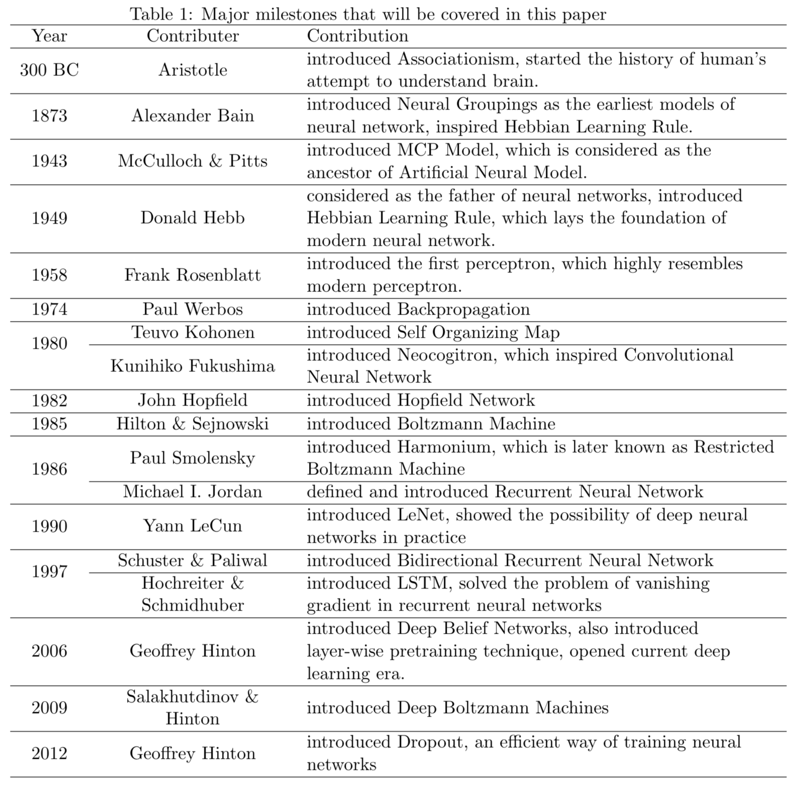{width=600px}

The current AI wave came in 2012 when AlexNet (60 million parameters) cuts the error rate of ImageNet competition (classify 1.2 million natural images) by half.

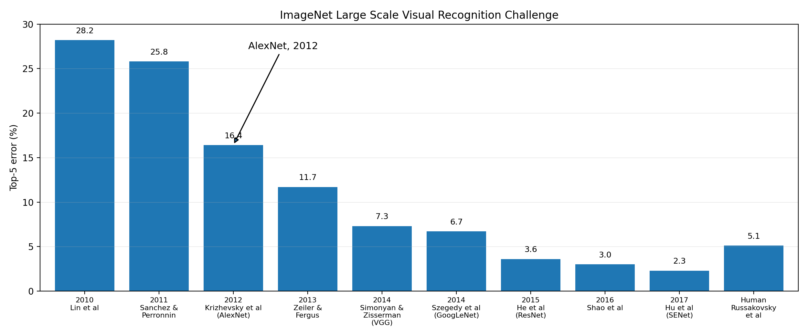{width=600px}

## Canonical datasets for computer vision tasks

- [MNIST](http://yann.lecun.com/exdb/mnist/)

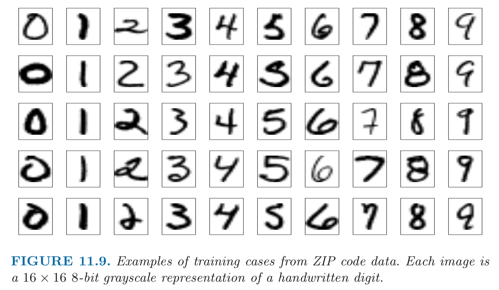{width=500px}

- [Fashion MNIST](https://github.com/zalandoresearch/fashion-mnist#fashion-mnist)

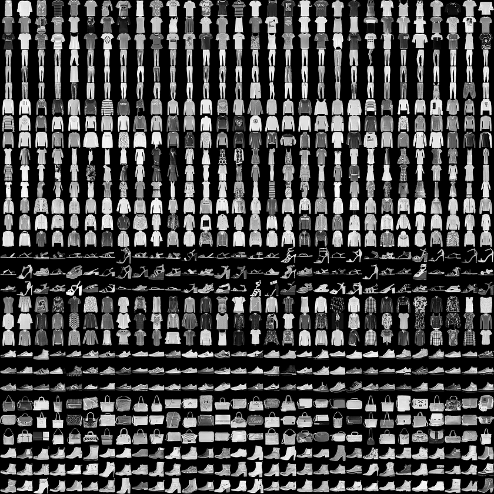{width=500px}

- [CIFAR10 and CIFAR100](https://www.cs.toronto.edu/~kriz/cifar.html)

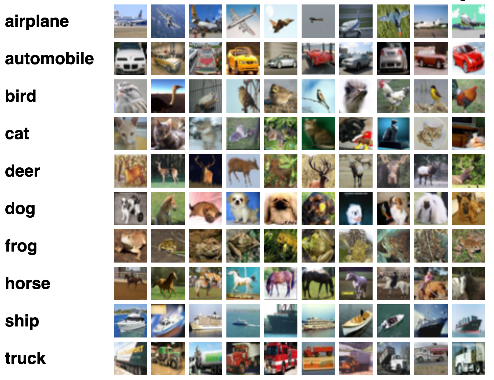{width=500px}

- [ImageNet](https://www.image-net.org/)

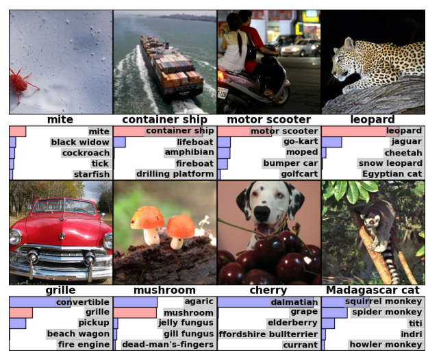{width=500px}

- [Microsoft COCO](https://cocodataset.org/#home) (object detection, segmentation, and captioning)

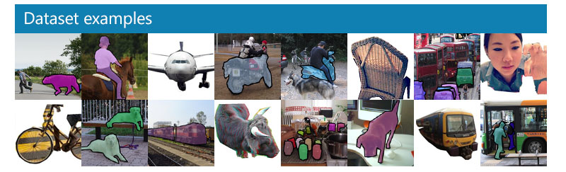{width=500px}

- [ADE20K](http://groups.csail.mit.edu/vision/datasets/ADE20K/) (scene parsing)

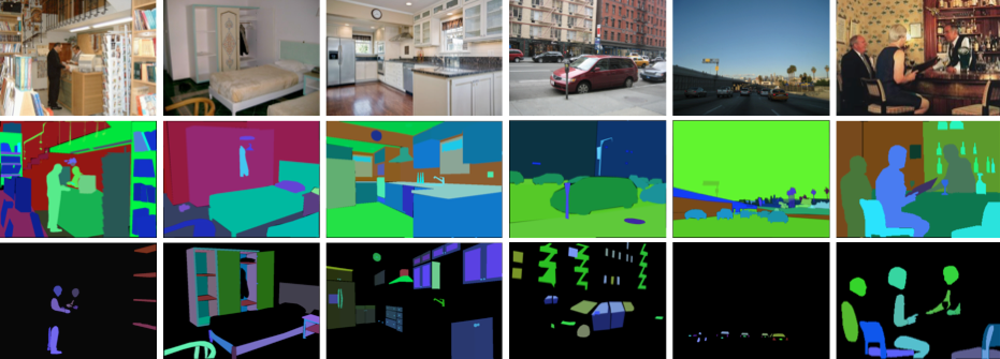{width=500px}

## Single layer neural network

::: {#fig-slp}

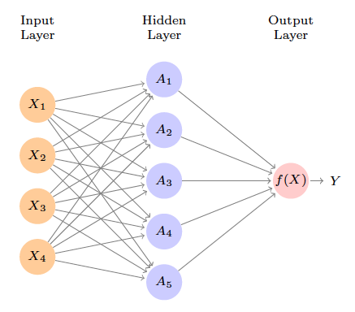{width=400px height=400px}

Neural network with a single hidden layer. The hidden layer computes activations $A_k = h_k(X)$ that are nonlinear transformations of linear combinations of the inputs $X_1, X_2, \ldots, X_p$. Hence these $A_k$ are not directly observed. The functions $h_k(\cdot)$ are not fixed in advance, but are learned during the training of the network. The output layer is a linear model that uses these activations $A_k$ as inputs, resulting in a function $f(X)$.

:::

- Inspired by the biological neuron model.

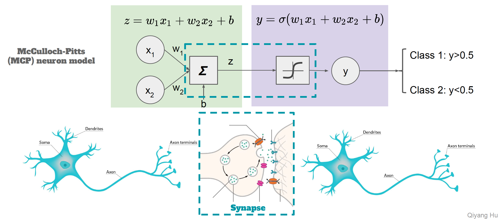{width=500px}

- Model:

\begin{eqnarray*}
f(X) &=& \beta_0 + \sum_{k=1}^K \beta_k h_k(X) \\
&=& \beta_0 + \sum_{k=1}^K \beta_k g(w_{k0} + \sum_{j=1}^p w_{kj} X_j).
\end{eqnarray*}

::: {.callout-note title="Connection to classical regression models"}
If we remove the hidden layer, neural networks reduce to familiar models:

- Identity output + squared loss  → **linear regression**
- Sigmoid output + cross-entropy  → **logistic regression**
- Softmax output + cross-entropy  → **multinomial logistic regression**

So a deep network can be viewed as “logistic regression on learned features.”
:::

### Activation functions

- **Activations** in the **hidden layer**:
$$
A_k = h_k(X) = g(w_{k0} + \sum_{j=1}^p w_{kj} X_j)
$$

- $g(z)$ is called the **activation function**. Popular are the **sigmoid** and **rectified linear**, shown in figure.

    - Sigmoid activation:
    $$
    g(z) = \frac{e^z}{1 + e^z} = \frac{1}{1 + e^{-z}}.
    $$
    
    - ReLU (rectified linear unit):
    $$
    g(z) = (z)_+ = \begin{cases}
    0 & \text{if } z<0 \\
    z & \text{otherwise}
    \end{cases}.
    $$
    According to Wikipedia: _The rectifier is, as of 2017, the most popular activation function for deep neural networks._

::: {#fig-activation}

{width=600px height=450px}

Activation functions. The piecewise-linear ReLU function is popular for its efficiency and computability. We have scaled it down by a factor of five for ease of comparison.

:::

- Activation functions in hidden layers are typically **nonlinear**, otherwise the model collapses to a linear model.

- So the activations are like derived features. Nonlinear transformations of linear combinations of the features.

- Consider a simple example with 2 input variables $X=(X_1,X_2)$ and $K=2$ hidden units $h_1(X)$ and $h_2(X)$ with $g(z) = z^2$. Assumings specific parameter values
\begin{eqnarray*}
\beta_0 = 0, \beta_1 &=& \frac 14, \beta_2 = - \frac 14 \\
w_{10} = 0, w_{11} &=& 1, w_{12} = 1 \\
w_{20} = 0, w_{21} &=& 1, w_{22} = -1.
\end{eqnarray*}
Then
\begin{eqnarray*}
h_1(X) &=& (0 + X_1 + X_2)^2, \\
h_2(X) &=& (0 + X_1 - X_2)^2.
\end{eqnarray*}
Plugging, we get
\begin{eqnarray*}
f(X) &=& 0 + \frac 14 \cdot (0 + X_1 + X_2)^2 - \frac 14 \cdot (0 + X_1 - X_2)^2 \\
&=& \frac 14[(X_1 + X_2)^2 - (X_1 - X_2)^2] \\
&=& X_1 X_2.
\end{eqnarray*}
So the sum of two nonlinear transformations of linear functions can give us an interaction!

### Loss function

- The model is fit by minimizing 
$$
\sum_{i=1}^n (y_{i} - f(x_i))^2.
$$ 
for **regression**.

## Multiple layer neural network

::: {#fig-mnist}

{width=600px height=300px}

{width=600px height=200px}

Examples of handwritten digits from the MNIST corpus. Each grayscale image has $28 \times 28$ pixels, each of which is an eight-bit number (0-255) which represents how dark that pixel is. The first 3, 5, and 8 are enlarged to show their 784 individual pixel values.

:::

- Example: MNIST digits. Handwritten digits $28 \times 28$ grayscale images. 60K train, 10K test images. Features are the 784 pixel grayscale values in [0,255]. Labels are the digit class 0-9.

    Goal: build a classifier to predict the image class.  
    
- We build a two-layer network with 256 units at first layer, 128 units at second layer, and 10 units at output layer.

- Along with intercepts (called **biases**) there are 235,146 parameters (referred to as **weights**). 

::: {#fig-mlp}

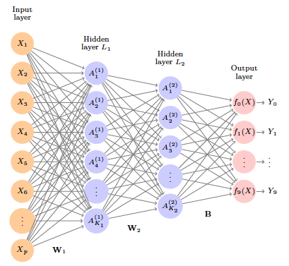{width=400px height=400px}

Neural network diagram with two hidden layers and multiple outputs, suitable for the MNIST handwritten-digit problem. The input layer has $p = 784$ units, the two hidden layers $K_1 = 256$ and $K_2 = 128$ units respectively, and the output layer 10 units. Along with intercepts (referred to as **biases** in the deep-learning community) this network has 235,146 parameters (referred to as **weights**).

:::

- **Output layer**: Let
$$
Z_m = \beta_{m0} + \sum_{\ell=1}^{K_2} \beta_{m\ell} A_{\ell}^{(2)}, m = 0,1,\ldots,9
$$
be 10 linear combinations of activations at second layer.

- Output activation function encodes the **softmax** function
$$
f_m(X) = \operatorname{Pr}(Y = m \mid X) = \frac{e^{Z_m}}{\sum_{\ell=0}^9 e^{Z_{\ell}}}.
$$

- We fit the model by minimizing the negative multinomial log-likelihood (or **cross-entropy**):
$$
\, - \sum_{i=1}^n \sum_{m=0}^9 y_{im} \log (f_m(x_i)).
$$
$y_{im}=1$ if true class for observation $i$ is $m$, else 0 (one-hot encoded).

- Results:

| Method                                  | Test Error |
|-----------------------------------------|------------|
| Neural Network + Ridge Regularization   | 2.3%       |
| Neural Network + Dropout Regularization | 1.8%       |
| Multinomial Logistic Regression         | 7.2%       |
| Linear Discriminant Analysis            | 12.7%      |

- Early success for neural networks in the 1990s.

- With so many parameters, regularization is essential.

- Very overworked problem -- best reported rates are <0.5%!

    Human error rate is reported to be around 0.2%, or 20 of the 10K test images.

## Expressivity of neural network

- Playground: <http://playground.tensorflow.org>

- Sources:  
    - [On the expressive power of deep neural network](https://arxiv.org/abs/1606.05336).  
    - [On the number of response regions of deep feed forward networks with piece-wise linear activations](https://arxiv.org/abs/1312.6098).  

- Consider the function $F: \mathbb{R}^m \mapsto \mathbb{R}^n$
$$
F(\mathbf{v}) = \text{ReLU}(\mathbf{A} \mathbf{v} + \mathbf{b}).
$$
Each equation
$$
\mathbf{a}_i^T \mathbf{v} + b_i = 0
$$
creates a hyperplane in $\mathbb{R}^m$. ReLU creates a _fold_ along that hyperplane. There are a total of $n$ folds.  
    - When there are $n=2$ hyperplanes in $\mathbb{R}^2$, 2 folds create 4 pieces.  
    - When there are $n=3$ hyperplanes in $\mathbb{R}^2$, 3 folds create 7 pieces. 
    
- The number of linear pieces of $\mathbb{R}^m$ sliced by $n$ hyperplanes is
$$
r(n, m) = \sum_{i=0}^m \binom{n}{i} = \binom{n}{0} + \cdots + \binom{n}{m}.
$$

    Proof: Induction using the recursion
$$
r(n, m) = r(n-1, m) + r(n-1, m-1).
$$

- Corollary:  
    - When there are relatively few neurons $n \ll m$, 
$$
r(n,m) \approx 2^n.
$$
    - When there are many neurons $n \gg m$, 
$$
r(n,m) \approx \frac{n^m}{m!}.
$$

- Counting the number of flat pieces with more hidden layers is much harder.

## Universal approximation properties

- Boolean Approximation: an MLP of one hidden layer can represent any Boolean function exactly.

- Continuous Approximation: an MLP of one hidden layer can approximate any bounded continuous function with arbitrary accuracy.

- Arbitrary Approximation: an MLP of two hidden layers can approximate any function with arbitrary accuracy.

## Convolutional neural network (CNN)

- Major success story for classifying images.

::: {#fig-cifar}

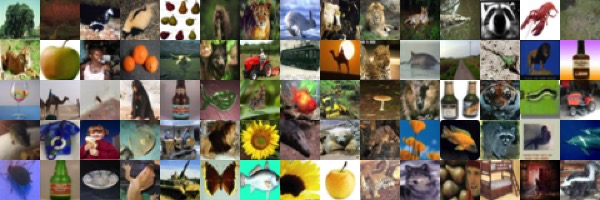{width=600px height=300px}

A sample of images from the CIFAR100 database: a collection of natural images from everyday life, with 100 different classes represented. $32 \times 32$ color natural images, with 100 classes.

:::

- CIFAR100: 50K training images, 10K test images. 

    Each image is a three-dimensional array or feature map: $32 \times 32 \times 3$ array of 8-bit numbers. The last dimension represents the three color channels for red, green and blue.

::: {#fig-cifar}

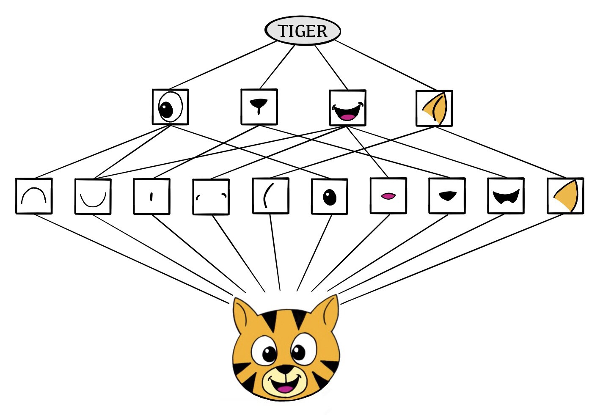{width=600px height=400px}

Schematic showing how a convolutional neural network classifies an image of a tiger. The network takes in the image and identifies local features. It then combines the local features in order to create compound features, which in this example include eyes and ears. These compound features are used to output the label _tiger_.

:::

- The CNN builds up an image in a hierarchical fashion.

- Edges and shapes are recognized and pieced together to form more complex shapes, eventually assembling the target image.

- This hierarchical construction is achieved using **convolution** and **pooling** layers.

### Convolution

- The convolution filter is itself an image, and represents a small shape, edge, etc.

- We slide it around the input image, scoring for matches.

- The scoring is done via **dot-products**, illustrated above.
$$
\text{Input image} = \begin{pmatrix}
a & b & c \\
d & e & f \\
g & h & i \\
j & k & l
\end{pmatrix}
$$
$$
\text{Convolution Filter} = \begin{pmatrix}
\alpha & \beta \\
\gamma & \delta
\end{pmatrix}
$$
$$
\text{Convolved Image} = \begin{pmatrix}
a \alpha + b \beta + d \gamma + e \delta & b \alpha + c \beta + e \gamma + f \delta \\
d \alpha + e \beta + g \gamma + h \delta & e \alpha + f \beta + h \gamma + i \delta \\
g \alpha + h \beta + j \gamma + k \delta & h \alpha + i \beta + k \gamma + l \delta
\end{pmatrix}
$$

{width=400px}

- If the subimage of the input image is similar to the filter, the score is high, otherwise low.

::: {#fig-convolution}

{width=600px height=400px}

The two filters shown here highlight vertical and horizontal stripes.

:::

- Interactive visualization: <https://setosa.io/ev/image-kernels/>

- The filters are **learned** during training.

- The idea of convolution with a filter is to find common patterns that occur in different parts of the image.

- The result of the convolution is a new feature map.

- Since images have three colors channels, the filter does as well: one filter per channel, and dot-products are summed.

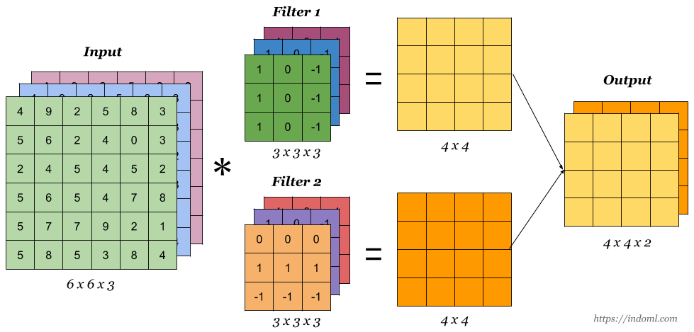{width=400px}

Source: <https://indoml.com/2018/03/07/student-notes-convolutional-neural-networks-cnn-introduction/>

### Pooling

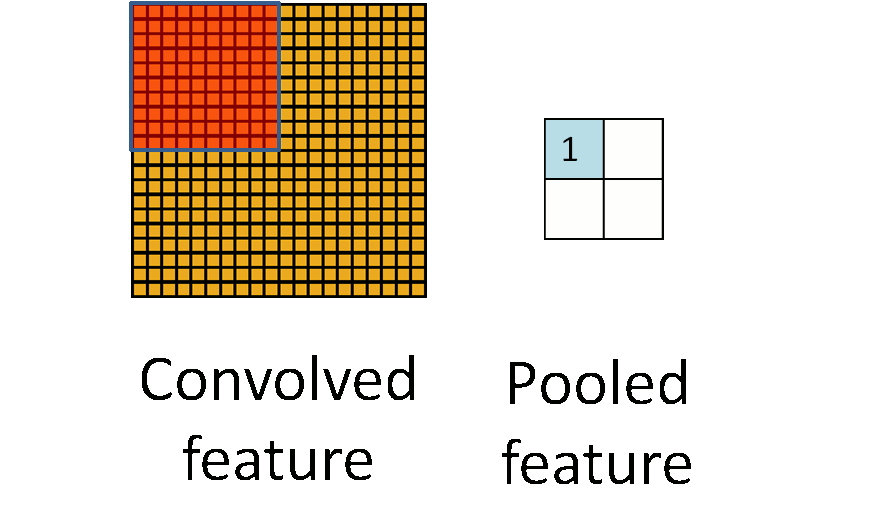{width=400px}

- Max pool:
$$
\begin{pmatrix}
1 & 2 & 5 & 3 \\
3 & 0 & 1 & 2 \\
2 & 1 & 3 & 4 \\
1 & 1 & 2 & 0
\end{pmatrix} \to \begin{pmatrix}
3 & 5 \\
2 & 4
\end{pmatrix}
$$

- Each non-overlapping $2 \times 2$ block is replaced by its maximum.

- This sharpens the feature identification.

- Allows for locational invariance.

- Reduces the dimension by a factor of 4.

### CNN architecture

::: {#fig-cnn-arch}

{width=600px height=200px}

Architecture of a deep CNN for the CIFAR100 classification task. Convolution layers are interspersed with $2 \times 2$ max-pool layers, which reduce the size by a factor of 2 in both dimensions.

:::

- Many convolve + pool layers.

- Filters are typically small, e.g. each channel $3 \times 3$.

- Each filter creates a new channel in convolution layer.

- As pooling reduces size, the number of filters/channels is typically increased.

- Number of layers can be very large. E.g. resnet50 trained on ImageNet 1000-class image data base has 50 layers!

### Results using pre-trained resnet50 

::: {#fig-cnn-arch}

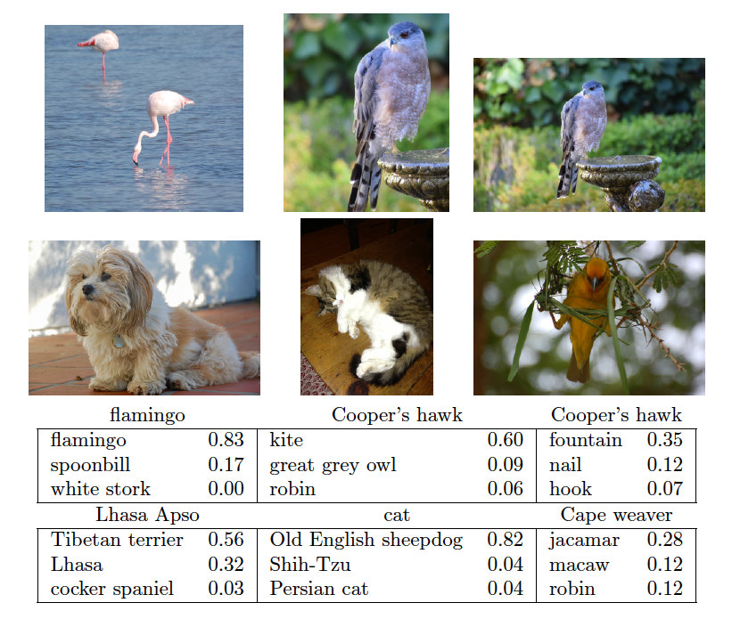{width=600px height=600px}

Classification of six photographs using the resnet50 CNN
trained on the ImageNet corpus.

:::

::: {.callout-note title="Why pretrained CNNs are popular in biomed"}
In practice, we often use **transfer learning**:

- start from an ImageNet-pretrained backbone (e.g., ResNet50),
- replace the final classification head for the biomedical labels,
- then fine-tune (sometimes freezing early layers first).

This is useful because biomedical labeled datasets are often much smaller than ImageNet.
:::

## Popular architectures for image classification

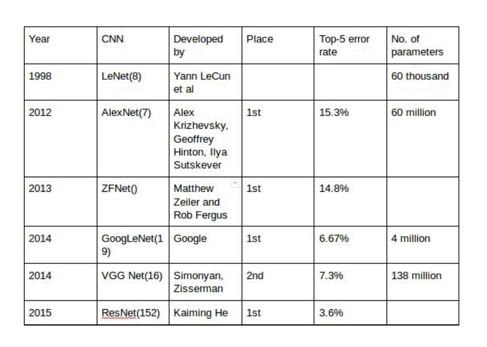{width=500px}

Source: [Architecture comparison of AlexNet, VGGNet, ResNet, Inception, DenseNet](https://towardsdatascience.com/architecture-comparison-of-alexnet-vggnet-resnet-inception-densenet-beb8b116866d)

::: {#fig-cnn-arch-layers}

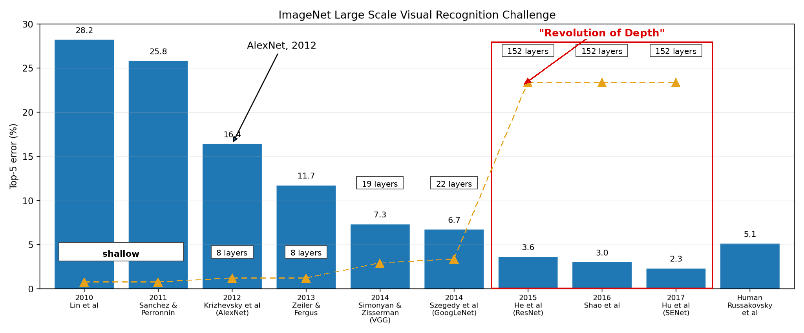{width=800px}

Y-axis is error rate in the winning architecture for each year of the ImageNet Large Scale Visual Recognition Challenge (ILSVRC). The x-axis is the year. The error rate of the winning architecture has been decreasing rapidly since 2012, and in 2015 it surpassed human performance. The orange triangle is the number of layers. 

:::

### AlexNet

Source: <http://cs231n.github.io/convolutional-networks/>

- [ImageNet](http://www.image-net.org) dataset. Classify 1.2 million high-resolution images ($224 \times 224 \times 3$) into 1000 classes.

- **AlexNet**: [Krizhevsky, Sutskever, Hinton (2012)](http://www.cs.toronto.edu/~fritz/absps/imagenet.pdf)

- A combination of techniques: GPU, ReLU, DropOut (0.5), SGD + Momentum with 0.9, initial learning rate 0.01 and again reduced by 10 when validation accuracy become flat.

- 5 convolutional layers, pooling interspersed, 3 fully connected layers. $\sim 60$ million parameters, 650,000 neurons.

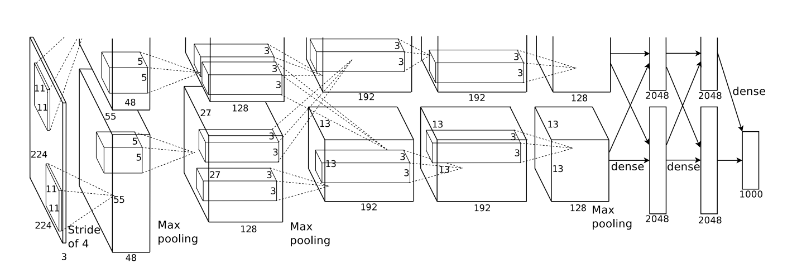{width=500px}

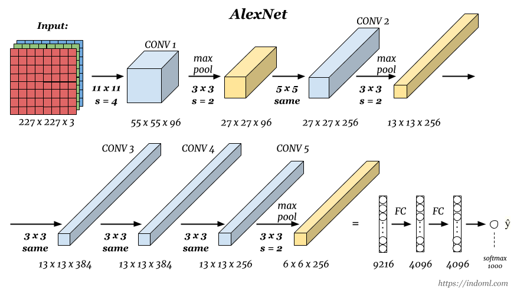{width=500px}

- AlexNet was the winner of the ImageNet Large Scale Visual Recognition Challenge (ILSVRC) classification the benchmark in 2012.

- Achieved 62.5% accuracy:

{width=500px}

  
96 learnt filters:  

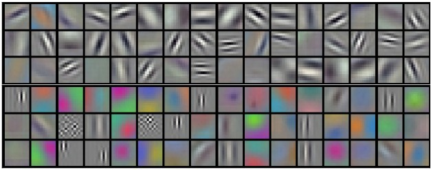{width=500px}

### VGG

[**VGG-16**](https://arxiv.org/abs/1409.1556) and VGG-19 (2014). The numbers 16 and 19 refer to the number of trainable layers. VGG-16 has $\sim 138$ million parameters. **VGGNet** was the runner up of the ImageNet Large Scale Visual Recognition Challenge (ILSVRC) classification the benchmark in 2014.

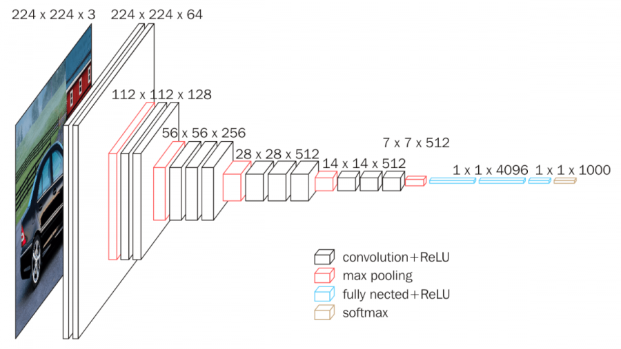{width=400px}

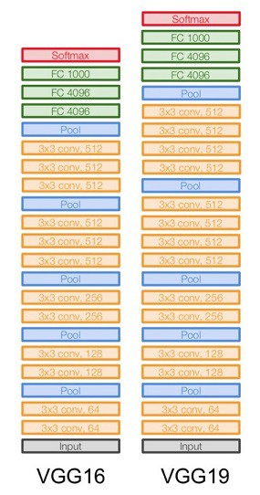{height=400px}

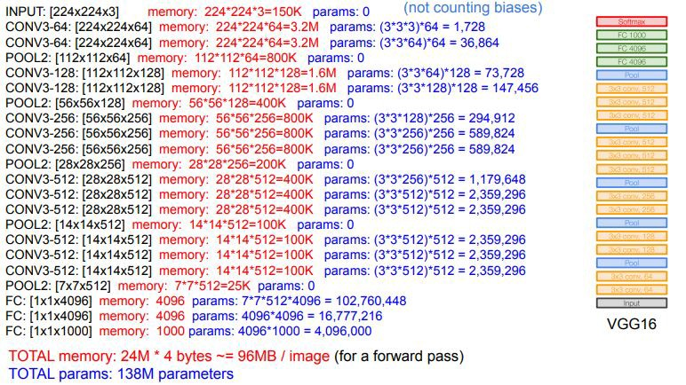{width=400px}

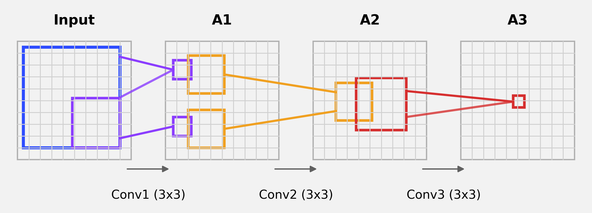{width=600px}

### ResNet

[**ResNet**](https://arxiv.org/abs/1512.03385) secured 1st Position in ILSVRC and COCO 2015 competition with an error rate of 3.6% (Better than Human Performance !!!) Batch Normalization after every conv layer. It also uses Xavier initialization with SGD + Momentum. The learning rate is 0.1 and is divided by 10 as validation error becomes constant. Moreover, batch-size is 256 and weight decay is 1e-5. The important part is there is no dropout is used in ResNet.

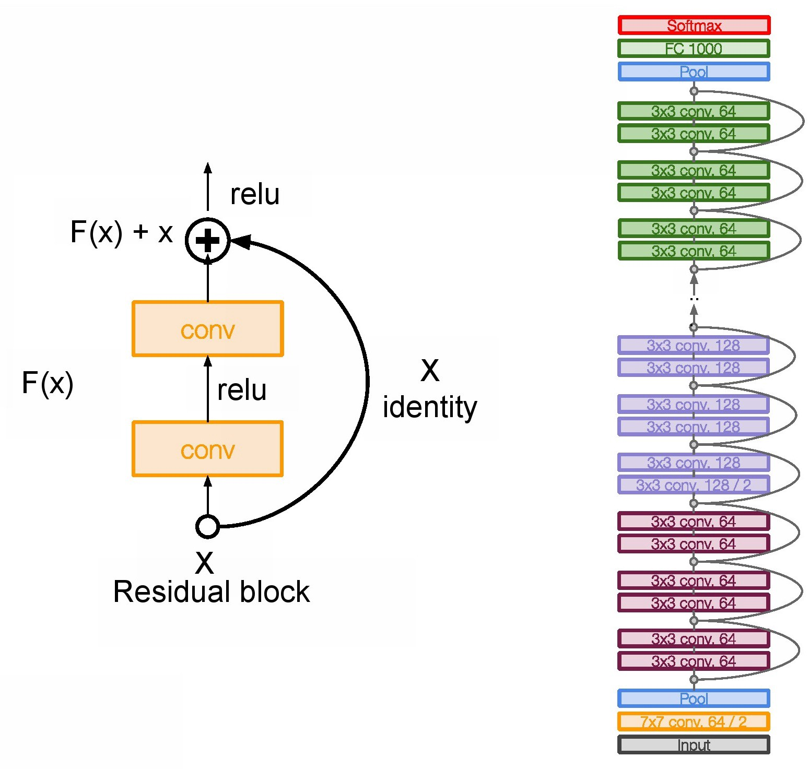{width=400px}

### Inception

Inception-v3 with 144 crops and 4 models ensembled, the top-5 error rate of 3.58% is obtained, and finally obtained 1st Runner Up (image classification) in ILSVRC 2015. The motivation of the inception network is, rather than requiring us to pick the filter size manually, let the network decide what is best to put in a layer. [GoogLeNet](https://arxiv.org/abs/1409.4842) has 9 inception modules.

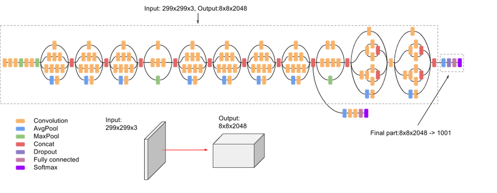{width=600px}

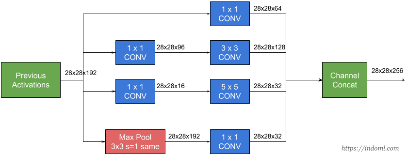{width=500px}

## Document classification: IMDB movie reviews.

- The `IMDB` corpus consists of user-supplied movie ratings for a large collection of movies. Each has been labeled for sentiment as **positive** or **negative**. Here is the beginning of a negative review:

> This has to be one of the worst films of the 1990s. When my friends
& I were watching this film (being the target audience it was aimed at) we just sat & watched the first half an hour with our jaws touching the floor at how bad it really was. The rest of the time, everyone else in the theater just started talking to each other, leaving or generally crying into their popcorn...

- We have labeled training and test sets, each consisting of 25,000 reviews, and each balanced with regard to sentiment.

    We wish to build a classifier to predict the sentiment of a review.
    
### Feature extraction: bag of words

- Documents have different lengths, and consist of sequences of words. How do we create features $X$ to characterize a document?

- From a dictionary, identify the 10K most frequently occurring words.

- Create a binary vector of length $p = 10K$ for each document, and score a 1 in every position that the corresponding word occurred.

- With $n$ documents, we now have an $n \times p$ sparse feature matrix $X$.

- **Bag-of-n-grams** model. Bag-of-words are **unigrams**. We can instead use **bigrams** (occurrences of adjacent word pairs), and in general **$m$-grams**.

- For more complicated feature extraction from text data, see the book [_Text Mining with R: A Tidy Approach_](https://www.tidytextmining.com/)

### Lasso versus neural network: IMDB reviews

ISL textbook compares a lasso logistic regression model to a two-hidden-layer neural network. (No convolutions here!)

::: {#fig-cnn-arch}

{width=600px height=450px}

Accuracy of the lasso and a two-hidden-layer neural network on the IMDB data. For the lasso, the x-axis displays $−\log(\lambda)$, while for the neural network it displays **epochs** (number of times the fitting algorithm passes through the training set). Both show a tendency to overfit, and achieve approximately the same test accuracy.

:::

## Fitting neural networks

{width=400px height=400px}

$$
\min_{w_1,\ldots,w_K,\beta} \quad \frac 12 \sum_{i=1}^n (y_i - f(x_i))^2,
$$
where
$$
f(x_i) = \beta_0 + \sum_{k=1}^K \beta_k g(w_{k0} + \sum_{j=1}^p w_{kj} x_{ij}).
$$

- This problem is difficult because the objective is **non-convex**.

- Despite this, effective algorithms have evolved that can optimize complex neural network problems efficiently.

### Gradient descent

::: {#fig-gd}

{width=600px height=450px}

Illustration of gradient descent for one-dimensional $\theta$. The objective function $R(\theta)$ is not convex, and has two minima, one at $\theta = −0.46$ (local), the other at $\theta = 1.02$ (global). Starting at some value $\theta^0$ (typically randomly chosen), each step in $\theta$ moves downhill - against the gradient - until it cannot go down any further. Here gradient descent reached the global minimum in 7 steps.

:::

- Let
$$
R(\theta) = \frac 12 \sum_{i=1}^n (y_i - f_\theta(x_i))^2
$$
with $\theta = (w_1,\ldots,w_K,\beta)$.

    1. Start with a guess $\theta_0$ for all the parameters in $\theta$, and set $t = 0$.  
    
    2. Iterate until the objective $R(\theta)$ fails to decrease:  
    
        (a). Find a vector $\delta$ that reflects a small change in $\theta$ such that $\theta^{t+1} = \theta^t + \delta$ reduces the objective; i.e. $R(\theta^{t+1}) < R(\theta^t)$.  
        
        (b). Set $t \gets t+1$.
        
- In this simple example we reached the **global minimum**.

- If we had started a little to the left of $\theta^0$ we would have gone in the other direction, and ended up in a local minimum.

- Although $\theta$ is multi-dimensional, we have depicted the process as one-dimensional. It is much harder to identify whether one is in a local minimum in high dimensions.

- How to find a direction $\delta$ that points downhill? We compute the gradient vector
$$
\nabla R(\theta^t) = \frac{\partial R(\theta)}{\partial \theta} \mid_{\theta = \theta^t}
$$
and set
$$
\theta^{t+1} \gets \theta^t - \rho \nabla R(\theta^t),
$$
where $\rho$ is the **learning rate** (typically small, e.g., $\rho=0.001$).

- Since $R(\theta) = \sum_{i=1}^n R_i(\theta)$ is a sum, so gradient is sum of gradients.
$$
R_i(\theta) = \frac 12 (y_i - f_\theta(x_i))^2 = \frac 12 (y_i - \beta_0 - \sum_{k=1}^K \beta_k g(w_{k0} + \sum_{j=1}^p w_{kj} x_{ij}))^2.
$$
For ease of notation, let
$$
z_{ik} = w_{k0} + \sum_{j=1}^p w_{kj} x_{ij}.
$$

- **Backpropagation** uses the chain rule for differentiation:
\begin{eqnarray*}
\frac{\partial R_i(\theta)}{\partial \beta_k} &=& \frac{\partial R_i(\theta)}{\partial f_\theta(x_i)} \cdot \frac{\partial f_\theta(x_i)}{\partial \beta_k} \\
&=& - (y_i - f_\theta(x_i)) \cdot g(z_{ik}) \\
\frac{\partial R_i(\theta)}{\partial w_{kj}} &=& \frac{\partial R_i(\theta)}{\partial f_\theta(x_i)} \cdot \frac{\partial f_\theta(x_i)}{\partial g(z_{ik})} \cdot \frac{\partial g(z_{ik})}{\partial z_{ik}} \cdot \frac{\partial z_{ik}}{\partial w_{kj}} \\
&=& - (y_i - f_\theta(x_i)) \cdot \beta_k \cdot g'(z_{ik}) \cdot x_{ij}.
\end{eqnarray*}

- Two-pass updates:
\begin{eqnarray*}
    & & \text{initialization} \to z_{ik} \to g(z_{ik}) \to \widehat{f}_{\theta}(x_i) \quad \quad \quad \text{(forward pass)}   \\
    &\to& y_i - f_\theta(x_i) \to \frac{\partial R_i(\theta)}{\partial \beta_k}, \frac{\partial R_i(\theta)}{\partial w_{kj}} \to \widehat{\beta}_{k} \text{ and } \widehat{w}_{kj} \quad \quad \text{(backward pass)}.
\end{eqnarray*}

- Advantages: each hidden unit passes and receives information only to and from units that share a connection; can be implemented efficiently on a parallel architecture computer.

- Tricks of the trade

    - **Slow learning**. Gradient descent is slow, and a small learning rate $\rho$ slows it even further. With **early stopping**, this is a form of regularization.  
    
    - **Stochastic gradient descent**. Rather than compute the gradient using all the data, use a small **minibatch** drawn at random at each step. E.g. for `MNIST` data, with n = 60K, we use minibatches of 128 observations.
    
    - An **epoch** is a count of iterations and amounts to the number of minibatch updates such that $n$ samples in total have been processed; i.e. $60,000/128 \approx 469$ minibatches for `MNIST`.
    
    - **Regularization**. Ridge and lasso regularization can be used to shrink the weights at each layer. Two other popular forms of regularization are **dropout** and **augmentation**.
    
### Dropout learning

::: {#fig-dropout}

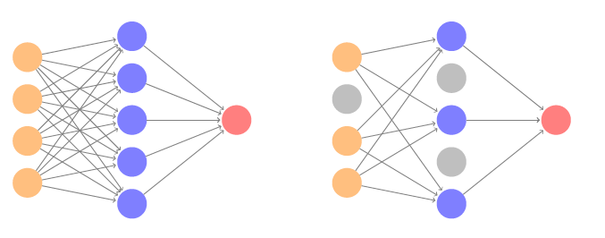{width=600px}

Dropout Learning. Left: a fully connected network. Right: network with dropout in the input and hidden layer. The nodes in grey are selected at random, and ignored in an instance of training.

:::

- At each SGD update, **drop** each unit with probability $\phi$ (so the **keep probability** is $q = 1-\phi$). For the units that are kept, scale their activations (equivalently their outgoing weights) by $1/q$ ("inverted dropout") so that the overall signal level is comparable between training and test.

- More explicitly, if $a^{(\ell)}\in\mathbb{R}^{H_\ell}$ denotes the vector of activations entering layer $\ell$, draw a random mask $m^{(\ell)}\in\{0,1\}^{H_\ell}$ with independent components $m^{(\ell)}_j\sim\text{Bernoulli}(q)$, and use
$$
\tilde a^{(\ell)} = \frac{m^{(\ell)}}{q} \odot a^{(\ell)},
$$
where $\odot$ denotes elementwise multiplication.

- The scaling by $1/q$ ensures that the *expected* activation is unchanged:
$$
\mathbb{E}[\tilde a^{(\ell)}] = a^{(\ell)}.
$$
At **test time**, we use the full network without masking (i.e. replace $\tilde a^{(\ell)}$ by $a^{(\ell)}$).

- Interpretation: each minibatch update trains a different "thinned" subnetwork; prediction with the full network approximates averaging an ensemble of many subnetworks (a form of **model averaging**).

- **Connection to ridge (a simple derivation).** Consider linear regression
$$
f_\beta(x)=\beta_0+\sum_{j=1}^p \beta_j x_j
$$
with squared loss. Apply dropout to the inputs:
$$
\tilde x_{ij}=\frac{m_{ij}}{q}x_{ij},\qquad m_{ij}\sim\text{Bernoulli}(q)\ \text{independently}.
$$
Then for a fixed $x_i$,
$$
\mathbb{E}_m\Big[(y_i - f_\beta(\tilde x_i))^2\Big]
= (y_i - f_\beta(x_i))^2 + \frac{\phi}{q}\sum_{j=1}^p \beta_j^2 x_{ij}^2.
$$
Summing over $i$ yields a ridge-like penalty on $\beta$ (and if predictors are standardized so that $\sum_i x_{ij}^2\approx n$, this is approximately $\lambda\sum_j \beta_j^2$ with $\lambda\propto n\,\phi/q$).

- More broadly, dropout injects **multiplicative Bernoulli noise** and often behaves like an $\ell_2$-type shrinkage of weights; the exact equivalence is cleanest for squared-loss linear models (as above), while for deep nets it is better viewed as regularization via model averaging and reduced co-adaptation.

- As in ridge, the other units **stand** in for those temporarily removed, and their weights are drawn closer together.

- Similar to randomly omitting variables when growing trees in random forests.

### Ridge and data augmentation

- Make many copies of each $(x_i, y_i)$ and add a small amount of Gaussian noise to the $x_i$, a little cloud around each
observation, but leave the copies of $y_i$ alone!

- This makes the fit robust to small perturbations in $x_i$, and is equivalent to ridge regularization in an OLS setting.

- Data augmentation is especially effective with SGD. Natural transformations are made of each training image when it is sampled by SGD, thus ultimately making a cloud of images around each original training image.

- The label is left unchanged, in each case still `tiger`.

- Improves performance of CNN and is similar to ridge.

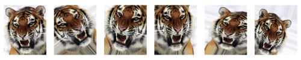{width=600px}

## Double descent

- With neural networks, it seems better to have too many hidden units than too few.

- Likewise more hidden layers better than few.

- Running stochastic gradient descent till zero training error often gives good out-of-sample error.

- Increasing the number of units or layers and again training till zero error sometimes gives **even better** out-of-sample error.

- What happened to overfitting and the usual bias-variance trade-off?

Belkin, Hsu, Ma and Mandal (2018) _Reconciling Modern Machine Learning and the Bias-Variance Trade-off_. [arXiv](https://arxiv.org/abs/1812.11118)

### Simulation study

- Model:
$$
y= \sin(x) + \epsilon
$$
with $x \sim$ Uniform(-5, 5) and $\epsilon$ is Gaussian with sd=0.3.

- Training set $n=20$, test set very large (10K).

- We fit a natural spline to the data with $d$ degrees of freedom, i.e., a linear regression onto $d$ basis functions
$$
\hat y_i = \hat \beta_1 N_1(x_i) + \hat \beta_2 N_2(x_i) + \cdots + \hat \beta_d N_d(x_i).
$$

- When $d = 20$ we fit the training data exactly, and get all residuals equal to zero.

- When $d > 20$, we still fit the data exactly, but the solution is not unique. Among the zero-residual solutions, we pick the one with **minimum norm**, i.e. the zero-residual solution with smallest $\sum_{j=1}^d \hat \beta_j^2$.

::: {#fig-double-descent}

{width=600px height=400px}

Double descent phenomenon, illustrated using error plots for a one-dimensional natural spline example. The horizontal axis refers to the number of spline basis functions on the log scale. The training error hits zero when the degrees of freedom coincides with the sample size $n = 20$, the "interpolation threshold", and remains zero thereafter. The test error increases dramatically at this threshold, but then descends again to a reasonable value before finally increasing again.

:::

- When $d \le 20$, model is OLS, and we see usual bias-variance trade-off.

- When $d > 20$, we revert to minimum-norm solution. As $d$ increases above 20, $\sum_{j=1}^d \hat \beta_j^2$ **decreases** since it is easier to achieve zero error, and hence less wiggly solutions.

::: {#fig-double-descent}

{width=600px height=400px}

To achieve a zero-residual solution with $d = 20$ is a real stretch! Easier for larger $d$.

:::

- Some facts.

    - In a wide linear model ($p \gg n$) fit by least squares, SGD with a small step size leads to a **minimum norm** zero-residual solution.
    
    - Stochastic gradient  **flow**, i.e. the entire path of SGD solutions, is somewhat similar to ridge path.
    
    - By analogy, deep and wide neural networks fit by SGD down to zero training error often give good solutions that generalize well.
    
    - In particular cases with high **signal-to-noise ratio**, e.g., image recognition, are less prone to overfitting; the zero-error solution is mostly signal!
    

