Credit: This note heavily uses material from 

- [_An Introduction to Statistical Learning: with Applications in R_](https://www.statlearning.com/) (ISL2).

- [_Elements of Statistical Learning: Data Mining, Inference, and Prediction_](https://hastie.su.domains/ElemStatLearn/) (ESL2).

- [_Deep Learning with Python_](https://www.manning.com/books/deep-learning-with-python) by Francois Chollet.

- UFLDL: <http://ufldl.stanford.edu/tutorial/>.

- Stanford CS231n: <http://cs231n.github.io>.

- _On the origin of deep learning_ by Wang and Raj (2017): <https://arxiv.org/pdf/1702.07800.pdf>

- _Learning Deep Learning_ lectures by Dr. Qiyang Hu (UCLA Office of Advanced Research Computing): <https://github.com/huqy/deep_learning_workshops>


- Lilian Weng, _Attention? Attention!_ (2018): <https://lilianweng.github.io/posts/2018-06-24-attention/>

## Recurrent neural network (RNN)

- Data often arise as sequences:

    - Documents are sequences of words, and their relative positions have meaning.
    
    - Time-series such as weather data or financial indices.
    
    - Recorded speech or music.
    
    - Handwriting, such as doctor's notes.
    
- RNNs build models that take into account this sequential nature of the data, and build a memory of the past.

- The feature for each observation is a sequence of vectors $X = \{X_1, X_2, \ldots, X_L\}$.

- The target $Y$ is often of the usual kind. For example, a single variable such as **Sentiment**, or a one-hot vector for multiclass.

- However, $Y$ can also be a sequence, such as the same document in a different language.

- Schematic of a simple recurrent neural network. 

::: {#fig-cnn-arch}

<p align="center">
{width=600px height=300px}
</p>

The input is a sequence of vectors $\{X_\ell\}_{\ell=1}^L$, and here the target is a single response. The network processes the input sequence $X$ sequentially; each $X_\ell$ feeds into the hidden layer, which also has as input the activation vector $A_{\ell-1}$ from the previous element in the sequence, and produces the current activation vector $A_{\ell}$. The **same** collections of weights $W$, $U$ and $B$ are used as each element of the sequence is processed. The output layer produces a sequence of predictions $O_\ell$ from the current  activation $A_\ell$, but typically only the last of these, $O_\ell$, is of relevance. To the left of the equal sign is a concise representation of the network, which is unrolled into a more
explicit version on the right.

:::

- In detail, suppose $X_\ell = (X_{\ell 1}, X_{\ell 2}, \ldots, X_{\ell p})$ has $p$ components, and $A_\ell = (A_{\ell 1}, A_{\ell 2}, \ldots, A_{\ell K})$ has $K$ components. Then the computation at the $k$th components of hidden unit $A_\ell$ is
\begin{eqnarray*}
  A_{\ell k} &=& g(w_{k0} + \sum_{j=1}^p w_{kj} X_{\ell j} + \sum_{s=1}^K u_{ks} A_{\ell-1,s}) \\
  O_\ell &=& \beta_0 + \sum_{k=1}^K \beta_k A_{\ell k}.
\end{eqnarray*}

- Often we are concerned only with the prediction $O_L$ at the last
unit. For squared error loss, and $n$ sequence/response pairs, we would minimize
$$
\sum_{i=1}^n (y_i - o_{iL})^2 = \sum_{i=1}^n (y_i - (\beta_0 + \sum_{k=1}^K \beta_kg(w_{k0} + \sum_{j=1}^p w_{ij} x_{iLj} + \sum_{s=1}^K u_{ks}A_{i,L-1,s})))^2.
$$

- RNN and IMDB reviews.

    - The document feature is a sequence of words $\{\mathcal{W}_\ell\}_1^L$. We typically truncate/pad the documents to the same number $L$ of words (we use $L = 80$).
    
    - Each word $\mathcal{W}_\ell$ is represented as a one-hot encoded binary vector $X_\ell$ (dummy variable) of length 10K, with all zeros and a single one in the position for that word in the dictionary.
    
    - This results in an extremely sparse feature representation, and would not work well.
    
    - Instead we use a lower-dimensional pretrained word embedding matrix $E$ ($m \times 10K$).
    
    - This reduces the binary feature vector of length 10K to a real feature vector of dimension $m \ll 10K$ (e.g. $m$ in the low hundreds.)
    
::: {#fig-word-embedding}

<p align="center">
{width=600px height=300px}
</p>

<p align="center">
{width=600px height=80px}
</p>

Depiction of a sequence of 20 words representing a single document: one-hot encoded using a dictionary of 16 words (top panel) and embedded in an $m$-dimensional space with $m = 5$ (bottom panel). Embeddings are pretrained on very large corpora of documents, using methods similar to principal components. `word2vec` and `GloVe` are popular.

:::

- After a lot of work, the results are a disappointing 76% accuracy.

- We then fit a more exotic RNN, an LSTM with long and short term memory. Here $A_\ell$ receives input from $A_{\ell-1}$ (short term memory) as well as from a version that reaches further back in time (long term memory). Now we get 87% accuracy, slightly less than the
88% achieved by glmnet.

- Leaderboard for IMDb sentiment analysis: <https://paperswithcode.com/sota/sentiment-analysis-on-imdb>.

## LSTM

- Short-term dependencies: to predict the last word in "the clouds are in the _sky_":
<p align="center">
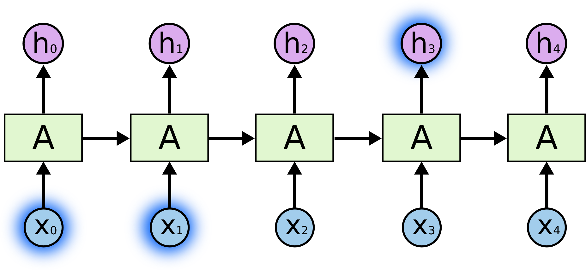{width=500px}
</p>

- Long-term dependencies: to predict the last word in "I grew up in France... I speek fluent _French_":
<p align="center">
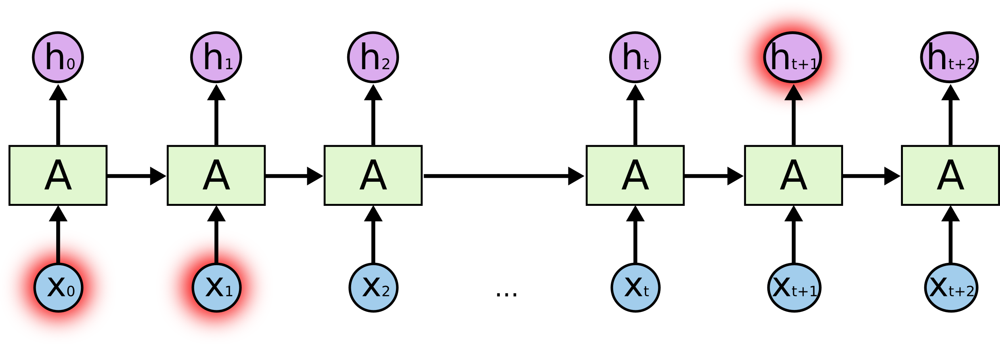{width=500px}
</p>

- Typical RNNs are having trouble with learning long-term dependencies.
<p align="center">
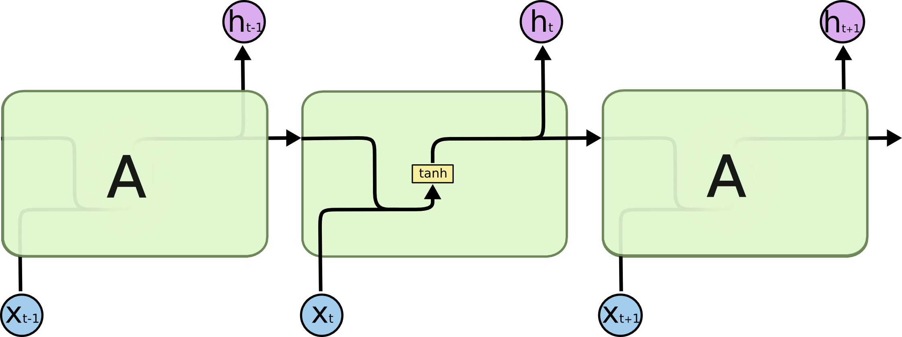{width=500px}
</p>

- **Long Short-Term Memory networks (LSTM)** are a special kind of RNN capable of learning long-term dependencies. 
<p align="center">
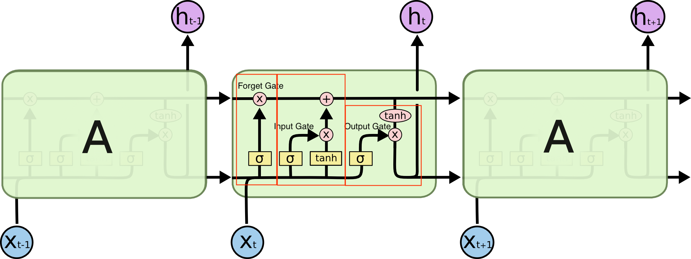{width=500px}
{width=500px}
</p>

    The **cell state** allows information to flow along it unchanged.
    <p align="center">
    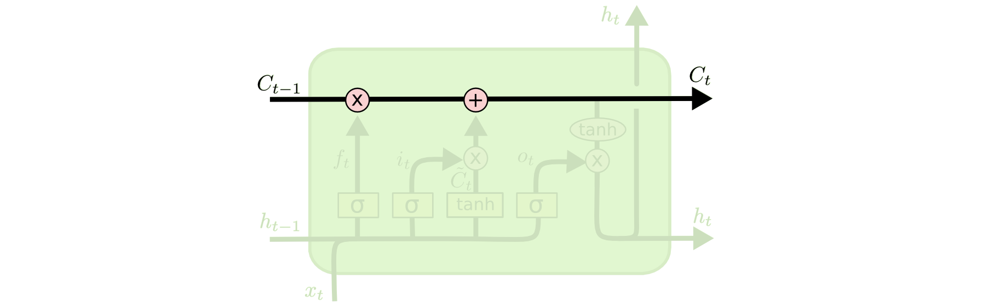{width=500px}
    </p>
    The **gates** give the ability to remove or add information to the cell state.
    <p align="center">
    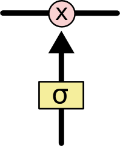{width=100px}
    </p>
    


## Transformers

More recent large language models (LLMs) such as ChatGPT extensively use **transformers**, which capture long-range dependencies *without* recurrent connections.

### Big picture

- RNN/LSTM process a sequence step-by-step; transformers process an entire sequence **in parallel**.
- The key primitive is **attention**: each position can “look at” (i.e., borrow information from) other positions in the sequence.

::: {#fig-transformer-big-picture}

```{mermaid}
%%| echo: false
flowchart LR
  A["Token sequence<br/>(w1,...,wL)"] --> B["Embeddings + Positional info"]
  B --> C["Transformer blocks<br/>(Self-attention + FFN)"]
  C --> D["Task head<br/>(classification / next token / seq2seq)"]
```

:::

### Why attention? From encoder–decoder RNNs to dynamic context

- In early **seq2seq** models, an **encoder** RNN reads the whole source sequence and compresses it into a *single* fixed-length **context vector** (a “thought vector”), and a **decoder** RNN generates the output from that context.
- A key limitation: for long sequences, a single fixed-length context can become a bottleneck (the encoder may “forget” early information).
- **Attention** fixes this by letting the decoder build a *new* context vector $c_t$ at each output step $t$, using a learned **soft alignment** over *all* encoder hidden states.

::: {#fig-weng-seq2seq fig-cap="Seq2seq encoder–decoder comparison (left: fixed-length context bottleneck; right: additive attention with a dynamic context vector). Source: Lilian Weng (2018), *Attention? Attention!*."}
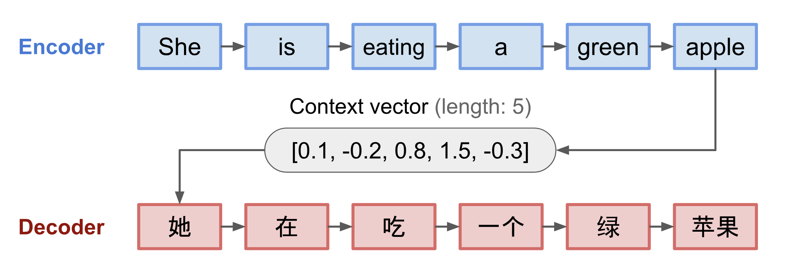{width=48%}
{width=48%}
:::

```{mermaid}
%%| echo: false
%%{init: {"theme":"neutral"}}%%
%%{init: {"flowchart": {"htmlLabels": true}}}%%

flowchart LR

  subgraph E["Encoder (BiRNN / GRU / LSTM)"]
    x1["x₁"] --> h1["h₁"]
    x2["x₂"] --> h2["h₂"]
    x3["…"]  --> hT["h<sub>n</sub>"]
  end

  subgraph AT["Attention (step t)"]
    sPrev["s<sub>t-1</sub>"] --> score["score(s<sub>t-1</sub>, h<sub>i</sub>)"]
    h1 --> score
    h2 --> score
    hT --> score
    score --> soft["softmax over i"]
    soft --> ct["c<sub>t</sub> = Σ<sub>i</sub> α<sub>t,i</sub> h<sub>i</sub>"]
  end

  subgraph D["Decoder (RNN / GRU / LSTM)"]
    yPrev["y<sub>t-1</sub>"] --> dec["s<sub>t</sub> = f(s<sub>t-1</sub>, y<sub>t-1</sub>, c<sub>t</sub>)"]
    ct --> dec
    dec --> yOut["y<sub>t</sub>"]
  end
```

### Seq2seq attention formulas (general recipe)

Let the encoder produce hidden states $h_1,\ldots,h_n$ for a source sequence $(x_1,\ldots,x_n)$.
At target step $t$, the decoder has a hidden state $s_{t-1}$ (from the previous step) and computes **alignment scores**
$$
e_{t,i} = \text{score}(s_{t-1}, h_i), \qquad i=1,\ldots,n.
$$

Convert scores into **attention weights** (a probability distribution over source positions):
$$
\alpha_{t,i} = \frac{\exp(e_{t,i})}{\sum_{i'=1}^n \exp(e_{t,i'})}.
$$

Then build the **context vector** as a weighted sum:
$$
c_t = \sum_{i=1}^n \alpha_{t,i} h_i.
$$

A helpful way to read this:

- $\alpha_{t,i}$ is “how much should output position $t$ attend to source position $i$?”
- The matrix $(\alpha_{t,i})$ across all $t$ and $i$ is an **alignment matrix** that can be visualized as a heatmap.

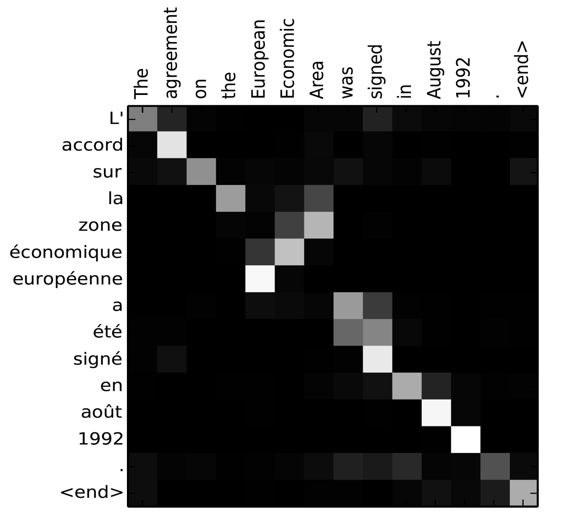{#fig-weng-alignment width=50%}

### Common alignment score functions (same idea, different parameterizations)

These are plug-in choices for $\text{score}(\cdot,\cdot)$:

- **Additive / concat (Bahdanau):**
$$
  \text{score}(s,h) = v_a^\top \tanh\!\big(W_a [s;h]\big).
$$
- **General (Luong):**
$$
  \text{score}(s,h) = s^\top W_a h.
$$
- **Dot-product:**
$$
  \text{score}(s,h) = s^\top h.
$$
- **Scaled dot-product:**
$$
  \text{score}(s,h) = \frac{s^\top h}{\sqrt{d}},
$$
  where $d$ is the hidden dimension. The scaling helps keep the softmax from saturating (i.e., avoids extremely small gradients) when $d$ is large.

### Soft vs hard attention; global vs local attention (useful vocabulary)

- **Soft attention:** attends to *all* positions with fractional weights $\alpha_{t,i}$. It is smooth/differentiable, but can be expensive for very large inputs.
- **Hard attention:** attends to a *single* position (or a small discrete set). It is cheaper but not differentiable, often requiring RL-style tricks.
- **Global attention (Luong):** compute $\alpha_{t,i}$ over *all* encoder states (similar spirit to soft attention).
- **Local attention (Luong):** predict an aligned position and attend to a window around it — a differentiable compromise between “hard” and “soft.”


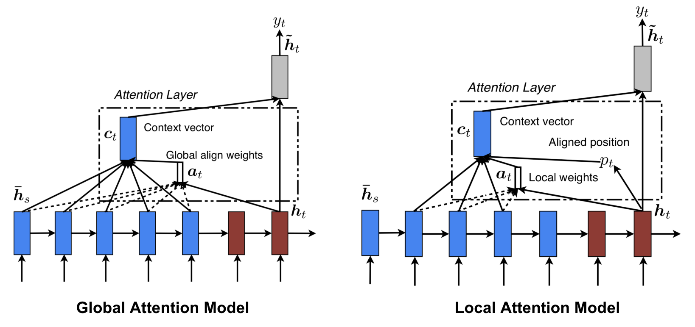{#fig-weng-global-local width=90%}

### Embeddings and positional information

- Let the input be token IDs $w_1,\ldots,w_L$ from a vocabulary of size $V$.
- A (learned or pretrained) embedding matrix $E \in \mathbb{R}^{V \times d}$ maps each token ID to a vector:
$$
  x_\ell = E[w_\ell] \in \mathbb{R}^d.
$$
- Unlike RNNs, self-attention does not “know” order by default (it is permutation-invariant), so we inject position information:
  - **Learned positional embeddings** $P[\ell]$, or
  - **Sinusoidal positional encodings** (fixed functions of $\ell$).
- The typical input to the first transformer block is
$$
  z_\ell = x_\ell + p_\ell.
$$

```{mermaid}
%%| echo: false
flowchart LR
  w["Token IDs"] --> e["Embedding lookup E[w]"]
  pos["Positions 1..L"] --> p["Positional embedding/encoding p"]
  e --> add["(+)"]
  p --> add
  add --> z["z1..zL"]
```

### Attention: the intuition

- Attention computes a **weighted average** of information (values) from other positions.
- The weights are data-adaptive: they depend on how well a **query** matches **keys**.

**Query / Key / Value idea** (for each position $\ell$):

- $q_\ell$: “what I am looking for”
- $k_t$: “what I contain” (for position $t$)
- $v_t$: “the content to pass along” (for position $t$)

Each position $\ell$ forms scores $s_{\ell t}$ comparing $q_\ell$ to $k_t$, converts them to weights $\alpha_{\ell t}$ (via softmax), then outputs
$$
\text{attn}(\ell) = \sum_{t=1}^L \alpha_{\ell t} v_t.
$$

If you want one compact formula for **scaled dot-product attention** (applied to a whole sequence):
$$
\text{Attention}(Q,K,V) = \text{softmax}\left(\frac{QK^\top}{\sqrt{d_k}}\right)V.
$$

- Why the scale $1/\sqrt{d_k}$? Dot products grow with dimension, which can make softmax saturate (tiny gradients). Scaling keeps gradients usable.


### Self-attention vs cross-attention

- **Self-attention:** $Q,K,V$ all come from the same sequence (each token attends to other tokens in the same sequence).
- **Cross-attention:** $Q$ comes from one sequence (e.g., decoder tokens) and $K,V$ come from another (e.g., encoder outputs).

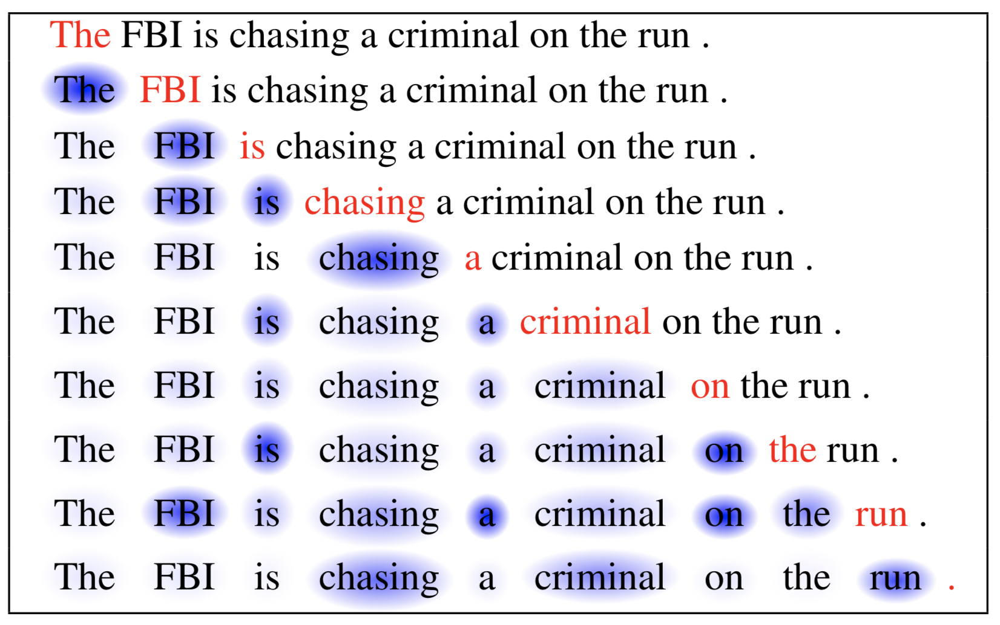{#fig-weng-self-attn-example width=65%}


### Multi-head attention (why multiple heads?)

- Instead of one attention operation, transformers use multiple “heads.”
- Intuition: each head can learn a different relation pattern (e.g., local context, long-range dependency, syntax-like cues).


A standard definition (writing attention in matrix form):

- First form query/key/value matrices via learned linear projections:
$$
  Q = ZW^Q,\quad K = ZW^K,\quad V = ZW^V.
$$
- One attention “head” is:
$$
  \text{head}_r = \text{Attention}(QW_r^Q,\;KW_r^K,\;VW_r^V).
$$
- Then combine $H$ heads:
$$
  \text{MultiHead}(Q,K,V) = \text{Concat}(\text{head}_1,\ldots,\text{head}_H)W^O.
$$

(Interpretation: different heads can focus on different *types* of relations.)

{#fig-weng-mha width=45%}

### Encoder and decoder blocks (what’s inside a transformer)

**Encoder block** (used in encoder-only models and the encoder part of seq2seq):

- Self-attention
- Position-wise feed-forward network (FFN)
- Residual connections + layer normalization (“Add & Norm”)

A typical **position-wise FFN** is just a 2-layer MLP applied to each position independently:
$$
\text{FFN}(x) = W_2\,\sigma(W_1 x + b_1) + b_2,
$$
where $\sigma$ is usually ReLU or GELU. The same FFN parameters are reused for every token position.


```{mermaid}
%%| echo: false
flowchart LR
  z[z] --> sa[Multi-head<br/>Self-attention]
  sa --> add1[(Add & Norm)]
  add1 --> ffn[Feed-forward<br/>network]
  ffn --> add2[(Add & Norm)]
  add2 --> out[Encoder output]
```

**Decoder block** (used for generation and seq2seq decoders):

- **Masked** self-attention (cannot look at future tokens)
- Cross-attention to encoder outputs (for seq2seq)
- FFN + residual + normalization

```{mermaid}
%%| echo: false
flowchart LR
  y["y (shifted targets)"] --> msa["Masked self-attention"]
  msa --> add1[(Add & Norm)]
  add1 --> ca["Cross-attention<br/>(to encoder)"]
  ca --> add2[(Add & Norm)]
  add2 --> ffn["Feed-forward<br/>network"]
  ffn --> add3[(Add & Norm)]
  add3 --> out["Decoder output"]
```

::: {#fig-weng-transformer-blocks fig-cap="Canonical Transformer encoder and decoder blocks (for reference). Source: Lilian Weng (2018), citing Vaswani et al. (2017)."}
{width=38%}
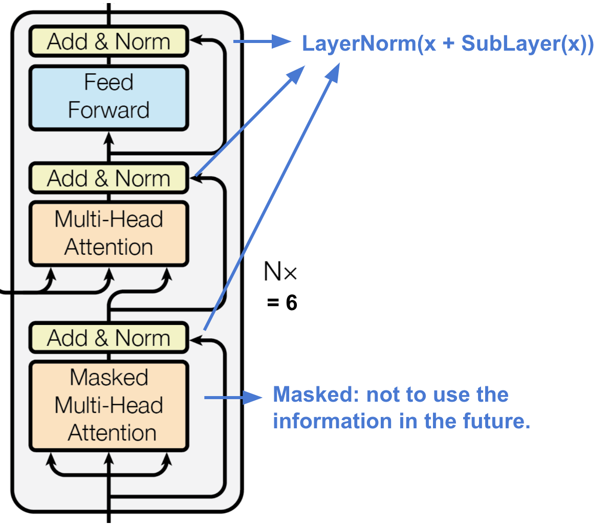{width=38%}
:::

### Encoder–decoder: how seq2seq works (translation-style)

- The **encoder** reads the full source sequence and produces contextual representations (a “memory”).
- The **decoder** generates the target sequence one token at a time.
  - During training, we feed in the true previous tokens (**teacher forcing**) as “shifted targets.”
  - During generation, we feed the model’s own previous predictions.

```{mermaid}
%%| echo: false
flowchart LR
  src["Source tokens"] --> enc["Encoder stack"]
  enc --> mem["Encoder states"]
  tgt["Target tokens<br/>(shifted)"] --> dec["Decoder stack"]
  mem --> dec
  dec --> out["Next-token<br/>probabilities"]
```

### Masking (two common masks)

- **Padding mask:** ignore padded tokens introduced by truncation/padding.
- **Causal mask (decoder):** prevent the model from seeing “future” tokens when predicting the next token.

### Transformer “families” you will see

- **Encoder-only:** good for understanding/classification tasks (e.g., BERT-like).
- **Decoder-only:** good for next-token prediction and generation (e.g., GPT-like).
- **Encoder–decoder:** good for seq2seq tasks (translation/summarization; T5-like).

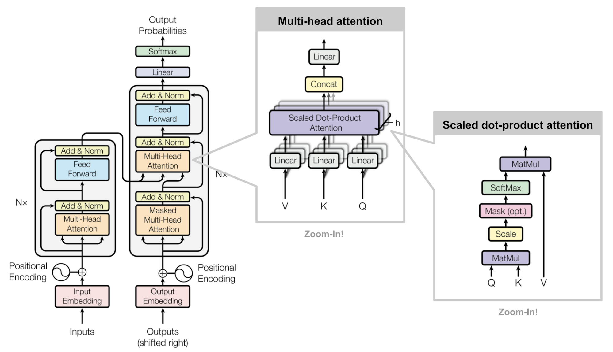{#fig-weng-transformer-arch width=95%}

### Why transformers usually beat RNN/LSTM at long context

- **Direct connections:** any token can attend to any other token in one step (no need to pass through $L$ recurrent steps).
- **Stable optimization:** residual connections give gradient “shortcuts.”
- **Parallelization:** training is much faster on modern hardware.
- Trade-off: vanilla attention is $\mathcal{O}(L^2)$ in sequence length; many variants exist to scale attention to longer sequences.

- Visual Guide to Transformer Neural Networks (Youtube)  
    - [Episode 1: Position Embeddings](https://youtu.be/dichIcUZfOw)  
    - [Episode 2: Multi-Head & Self-Attention](https://youtu.be/mMa2PmYJlCo)  
    - [Episode 3: Decoder’s Masked Attention](https://youtu.be/gJ9kaJsE78k)  

- [Transformer Models 101 (Towards Data Science)](https://towardsdatascience.com/transformer-models-101-getting-started-part-1-b3a77ccfa14d)

- [LSTM is dead. Long live Transformers! (Youtube)](https://youtu.be/S27pHKBEp30)

- Reference: Lilian Weng, _Attention? Attention!_ (2018): <https://lilianweng.github.io/posts/2018-06-24-attention/>


## Summary of RNNs

- We have presented the simplest of RNNs. Many more complex variations exist. 

- One variation treats the sequence as a one-dimensional image, and uses CNNs for fitting. For example, a sequence of words using an embedding representation can be viewed as an image, and the CNN convolves by sliding a convolutional filter along the sequence.

- Can have additional hidden layers, where each hidden layer is a sequence, and treats the previous hidden layer as an input sequence.

- Can have output also be a sequence, and input and output share the hidden units. So called `seq2seq` learning are used for language translation.


## When to use deep learning

- CNNs have had enormous successes in image classification and modeling, and are starting to be used in medical diagnosis. Examples include digital mammography, ophthalmology, MRI scans, and digital X-rays.

- RNNs have had big wins in speech modeling, language translation, and forecasting.

- Often the big successes occur when the signal to noise ratio is high, e.g., image recognition and language translation. Datasets are large, and overfitting is not a big problem.

- For noisier data, simpler models can often work better.

    - On the `NYSE` data, the AR(5) model is much simpler than a RNN, and performed as well.
    
    - On the `IMDB` review data, the linear model fit by glmnet did as well as the neural network, and better than the RNN.
    
- We endorse the **Occam's razor** principal. We prefer simpler models if they work as well. More interpretable! 
